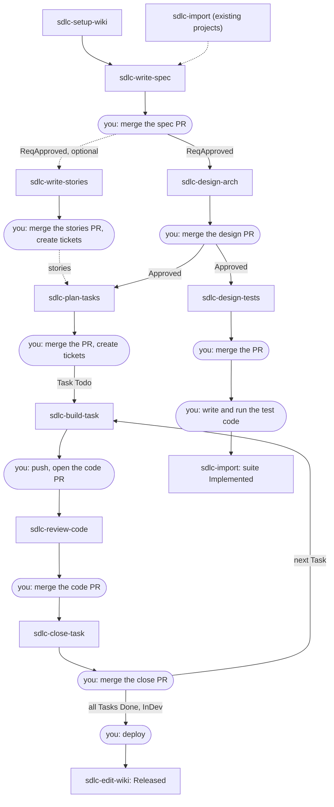

# sdlc-skills

Skills for AI agents that run a software project's lifecycle on a wiki of plain
Markdown files: requirements, specifications, architecture, tasks and tests.
Each project keeps its wiki in its own git repository, and every change goes
through a draft branch and a pull request.

The skills work with any AI agent that reads skill folders (a folder with a
`SKILL.md`), not only one vendor's. They need Python 3.11 or newer and git.

This README is for everyone on a project that keeps its wiki with these skills:
product owners and business analysts, architects, tech leads, developers, QA
and reviewers. Install the skills, set up the wiki, then follow
[the flow](#the-flow): which skill to run at each phase of the development
cycle, and what you do by hand in between.

## Install the skills

Clone this repository once, then run the script with the name of your agent:

```bash
git clone https://github.com/ntanh1402/sdlc-skills
sdlc-skills/install-skills.sh --agent claude
```

Run the script with no arguments to list the supported agent names:

| Agent | Name |
|---|---|
| Claude Code | `claude` |
| Codex | `codex` |
| Gemini CLI | `gemini` |
| Cursor | `cursor` |
| Copilot CLI | `copilot` |
| OpenCode | `opencode` |
| Windsurf | `windsurf` |

Repeat `--agent` to install into several agents at once. To update, run
`git pull` in the clone and run the script again. With `--link`, the script
links the skills to the clone instead of copying them, so `git pull` alone
updates them. For an agent not listed, pass the folder it reads its skills from
with `--folder <folder>`.

A third-party installer works too, for example
[`npx skills add ntanh1402/sdlc-skills -g`](https://github.com/vercel-labs/skills),
which knows the skills folder of many agents.

## Set up a project wiki

Start your agent in the folder you work in (your *workspace*), for example a
code repository, and ask it to set up the project wiki at a path, for example
`../shop-wiki`. The `sdlc-setup-wiki` skill:

- creates the wiki repository there, or upgrades its tool copy;
- writes a short note into the workspace's `AGENTS.md` (and `CLAUDE.md` if it
  exists) that says where the wiki is, so other skills find it.

Run it again from any other folder you want to link to the same wiki.

## The flow

### The development cycle

| Phase | Who | Skill | Wiki status afterwards | You do by hand |
|---|---|---|---|---|
| Setup, once per project | Tech lead | `sdlc-setup-wiki` | A wiki repository, linked to your workspace | Push the new wiki repository to your git host |
| Onboarding, existing projects only | Tech lead, architect | `sdlc-import`, once per code folder, document or test suite | `Released` Features, as-built Design files | Merge each import pull request |
| Requirements | BA / PO | `sdlc-write-spec` | Feature `ReqApproved` (a ChangeRequest: `ReqApproved`) | Merge the spec pull request |
| Design | Architect | `sdlc-design-arch` | `Approved` | Merge the design pull request |
| User stories, optional | BA / PO | `sdlc-write-stories`, alongside design | User stories (`STORY-…`) | Merge the stories pull request, create a ticket per story from its paste-ready copy |
| Planning | Tech lead | `sdlc-plan-tasks` | Tasks `Todo` | Merge the pull request, create the tracker tickets |
| Test design | QA | `sdlc-design-tests`, alongside planning | TestSuites `Approved` | Merge the pull request |
| Implementation | Developer | `sdlc-build-task`, once per Task | Unchanged (it writes code, not the wiki) | Push the code branch, open the pull request |
| Code review | Reviewer | `sdlc-review-code` | Unchanged (read-only) | Decide on the findings, merge the code pull request |
| Closing a Task | Developer | `sdlc-close-task` | Task `Done`; Feature `InDev`, or ChangeRequest `Implemented` once all its Tasks are `Done` | Merge the close pull request |
| Testing | QA, developers | Your usual tools | Unchanged | Write the test code from the TestCases and run it in CI. Then `sdlc-import` on the test code marks a suite `Implemented` |
| Release | Release manager | Your usual tools, then `sdlc-edit-wiki` | Feature `Released` | Deploy. Then ask `sdlc-edit-wiki` to mark the Feature released |
| Maintenance | Anyone | `sdlc-write-spec`, `sdlc-import`, `sdlc-edit-wiki` | A new ChangeRequest, or corrections | See below |

**Maintenance.** A bug, a security fix or any change to a released Feature is
a new ChangeRequest from `sdlc-write-spec`, and it goes through the same phases
from Design on. When the wiki and the code no longer agree, run `sdlc-import`
on the code folder: it compares the two and you decide each difference. A typo
or a glossary change goes to `sdlc-edit-wiki`.

At any time, anyone can ask the wiki a question with `sdlc-ask-wiki`. To turn a
PDF, Word or slide file into Markdown before `sdlc-write-spec` or `sdlc-import`
reads it, use `sdlc-convert-doc`.

One person can play several roles. The roles only tell you which rows are
yours.

### The flow in one picture



Rectangles are skills. Rounded boxes are steps you do yourself, because no
skill merges, pushes, opens a pull request, runs tests, deploys or touches a
tracker.

### The terms you need

| Term | Means |
|---|---|
| Feature (`FEAT-…`) | A capability of an Application: its PRD, Requirements and Architecture. Statuses: `Draft` → `ReqApproved` → `Approved` → `InDev` → `Released` (later `Deprecated`) |
| ChangeRequest (`CR-…`) | A change to one Feature that is already `Approved` or later. Statuses: `Proposed` → `ReqApproved` → `Approved` → `Implemented` (or `Rejected`) |
| Requirement (`REQ-…`) | One testable requirement inside a Feature or ChangeRequest |
| Design files | Services, endpoints, events, tables, frontends and externals. A design not built yet is marked as pending (`Planned`, `Modifying`, `Removing`) until its Task is closed |
| User story (`STORY-…`) | One actor's goal: "As a …, I want …, so that …" with Given/When/Then criteria, each citing a Requirement. Optional; no status, you follow it in your tracker |
| Reference (`REF-…`) | Material to read while working: a PRD, a test plan, a domain page, a vendor document, a code example. A folder with a summary, linked from any file under `# References`. Context, never a contract |
| Task (`TASK-…`) | One piece of build work. Only `Todo` or `Done`; you follow progress in your tracker, not in the wiki |
| TestSuite (`TS-…`), TestCase (`TC-…`) | The test design. A suite is `Implemented` once its test code exists |
| Draft | One skill run's changes, on a branch `wiki/<step>-<key>` of the wiki repository, for example `wiki/spec-FEAT-gift-cards`. The next step only sees it after you merge its pull request |

More terms are in [CONTEXT.md](CONTEXT.md).

### In a Scrum team

`sdlc-write-spec`, `sdlc-write-stories` and `sdlc-design-arch` belong to backlog
refinement: a Feature is ready for a sprint when its design is merged, and its
stories are the backlog items. `sdlc-plan-tasks` and
`sdlc-design-tests` belong to sprint planning, and their Tasks become your
tickets. `sdlc-build-task`, `sdlc-review-code` and `sdlc-close-task` run inside
the sprint, once for each Task. Marking a Feature released goes with your
release.

## How a skill run goes

To run a skill, ask your agent in plain words ("write the spec for gift
cards"), or call it by name (in Claude Code, `/sdlc-write-spec`). Start the
agent in your workspace: the folder that `sdlc-setup-wiki` linked to the wiki,
usually your code repository.

Every skill that writes the wiki runs the same way:

1. **It reads the wiki first**, so it does not ask what the wiki already says.
2. **It asks questions in rounds.** Each question is numbered and comes with a
   recommended answer and the wiki file behind it. Reply to each one by
   number, for example `1 ok, 2 ok, 3: only registered customers`. You get at
   least one round, even when your request seems complete.
3. **It stops three times for your approval:**
   - **Intent:** what will be done (the target, the scope).
   - **Design:** how. The full PRD, architecture, task plan or test design,
     plus a list of the files it will change.
   - **Change-set:** the exact diff and the commit message, before anything
     is committed.

   Approval means an explicit "yes". "Sounds good" or "whatever you think"
   does not count. Asking for an edit at a gate sends the skill back to that
   gate. If you say "don't ask me, just write it", the skill stops and lists
   the decisions it still needs from you.
4. **It checks its own work**, then commits the draft and pushes its branch.
5. **It ends with at most four lines:** what was done, what was not, anything
   another skill must handle, and the next step. For example:

   ```text
   Done: wiki/arch-FEAT-gift-cards, 6 files, pushed. Open the pull request.
   Next: sdlc-plan-tasks and sdlc-design-tests after the merge.
   ```

If a run stops part-way, run the same skill again. It finds its unfinished
draft and asks whether its plan still stands, then continues from there.

`sdlc-close-task` and `sdlc-edit-wiki` use a short form: they ask only when
something is unclear, and they stop once to show the exact change and once
for the change set. `sdlc-ask-wiki` and `sdlc-review-code` are read-only. They
ask nothing unless something is missing, and they write nothing.

## The skills

The skills are listed in the order of the flow. "Say" is an example request;
the names come from the sample wiki in
[wiki-llm/sample/shop](wiki-llm/sample/shop).

### sdlc-setup-wiki

- **Use when:** you start a project wiki, link another folder to it, add an
  Application, or another skill says the wiki is older than the skills.
- **Before:** nothing.
- **Say:** "Set up the project wiki at ../shop-wiki", "Add application
  billing to the wiki", "Upgrade the wiki".
- **You get:** a wiki repository with `wiki/` and its tool copy
  `.wiki-llm/`, plus a note in your workspace's `AGENTS.md` (and
  `CLAUDE.md`) that tells the other skills where the wiki is. An upgrade or a
  new Application comes as a draft to merge.
- **Next:** push a new wiki repository to your git host. Run the skill again
  from every other folder you want linked to the same wiki.

### sdlc-import

- **Use when:** the project already exists. It brings in one source per run:
  a service's or frontend's code, an architecture document, a PRD, a built
  capability with no document, a test suite, a test plan, or a page, document
  or code example to keep as a Reference. If the source is already in the
  wiki, it compares the two instead.
- **Before:** the wiki is set up and the Application exists. A non-text
  document is converted with `sdlc-convert-doc` first.
- **Say:** "Import the code of ../shop-orders", "Import docs/architecture.md",
  "Check the wiki against ../shop-orders".
- **You get:** as-built Design files, `Released` Features, decisions and
  `Implemented` TestSuites, which you confirm group by group. In a compare,
  you decide each difference.
- **Next:** merge the import pull request. Import the code before the tests
  of the same folder.

### sdlc-write-spec

- **Use when:** you define a new capability, turn a brief into requirements,
  or change a Feature: a bug, a security, performance or refactor change.
- **Before:** the Application exists. The skill decides whether your request
  is a new Feature or a ChangeRequest, and asks you to confirm.
- **Say:** "Write the spec for gift cards: customers pay part or all of an
  order with a gift card balance", "Add SMS as a second notification
  channel".
- **You get:** a new Feature (`FEAT-…`) with its Requirements and its PRD as
  a Reference (`REF-…-prd`), or a ChangeRequest (`CR-…`) when the Feature is
  already designed. At the Design
  gate you choose `ReqApproved` (ready for design) or keep it a draft.
- **Next:** merge the spec pull request, then `sdlc-design-arch`, and
  `sdlc-write-stories` at the same time if you want user stories.

### sdlc-write-stories

- **Use when:** a business analyst wants the approved Requirements of a
  Feature or ChangeRequest as user stories, or wants existing stories
  regrouped. Stories are optional.
- **Before:** the spec pull request is merged (`ReqApproved` or later). It
  runs at the same time as `sdlc-design-arch`.
- **Say:** "Break gift cards into user stories", "Write the user stories for
  CR-sms-notifications".
- **You get:** `STORY-…` files, one actor goal each, with Given/When/Then
  acceptance criteria that cite the Requirements. Every Functional
  Requirement is in a story. At the end, each story is printed ready to paste
  into a ticket.
- **Next:** merge the stories pull request and create the tickets. Once the
  design is merged, `sdlc-plan-tasks` links each Task to its stories; if the
  Tasks are already planned, run it again.

### sdlc-design-arch

- **Use when:** a Feature or ChangeRequest is `ReqApproved` and needs a
  technical design.
- **Before:** the spec pull request is merged.
- **Say:** "Design the gift cards feature".
- **You get:** the Architecture section, Mermaid diagrams, new or changed
  services, endpoints, events, tables and externals marked as pending,
  decisions (`ADR-…`), and status `Approved`.
- **Next:** merge the design pull request, then `sdlc-plan-tasks` and
  `sdlc-design-tests`, in either order or both at once.

### sdlc-plan-tasks

- **Use when:** an `Approved` design needs build Tasks, or a changed design
  needs its Tasks planned again.
- **Before:** the design pull request is merged.
- **Say:** "Plan the tasks for gift cards".
- **You get:** `TASK-…` files, each with its acceptance, planned scope,
  size, dependencies and wave. Every pending design item is covered by
  exactly one Task, and every user story is linked by a Task.
- **Next:** merge the pull request, then create a ticket for each Task in
  your tracker. To record the ticket link in the Task, ask
  `sdlc-edit-wiki`.

### sdlc-design-tests

- **Use when:** an `Approved` design needs test design: unit, integration,
  end-to-end, load or security.
- **Before:** the design pull request is merged.
- **Say:** "Design the tests for gift cards".
- **You get:** TestSuites (`TS-…`) with one TestCase (`TC-…`) per file, each
  with its risk, data, steps and checks, covering every Requirement and
  contract. It writes no test code.
- **Next:** merge the pull request. Your team writes and runs the test code;
  then `sdlc-import` on that code marks the suite `Implemented`.

### sdlc-build-task

- **Use when:** you implement one Task of the wiki.
- **Before:** the Task is merged and `Todo`, and its Feature or ChangeRequest
  is `Approved` (a Feature may be `InDev`). You name the code folder.
- **Say:** "Build TASK-gift-card-redeem in this folder".
- **You get:** the code and its unit tests, committed on a new branch
  (`task/<name>`, unless your conventions name branches differently) in a
  worktree, with a `Task: <key>` line in the commit message. Nothing is pushed
  and nothing is run.
- **Next:** build and run the tests yourself, push, open the pull request,
  then `sdlc-review-code`.

### sdlc-review-code

- **Use when:** you review a branch, a working tree or a pull request against
  the wiki.
- **Before:** the change is in a local code folder.
- **Say:** "Review this branch against TASK-gift-card-redeem".
- **You get:** a list of findings in the chat, each marked must fix or
  should fix, with the code location and the wiki file. It changes nothing
  and gives no verdict.
- **Next:** fix what you decide to fix, then merge the code pull request.

### sdlc-close-task

- **Use when:** a Task's code pull request is merged.
- **Before:** the merge is on the code repository's default branch, with the
  `Task: <key>` line that `sdlc-build-task` wrote.
- **Say:** "Close TASK-gift-card-redeem; the code is in ../shop-orders".
- **You get:** the Task `Done` with its merge commit, the Design files it
  covered marked as built, and the Feature `InDev` or the ChangeRequest
  `Implemented` (once all its Tasks are `Done`).
- **Next:** merge the close pull request. Close the ticket in your tracker
  yourself.

### sdlc-edit-wiki

- **Use when:** you need a small edit that no other skill owns: a typo or
  wording fix, the glossary or conventions, a Feature marked `Released` or
  `Deprecated`, a Reference added, linked or marked `Deprecated`, a Task's
  ticket or pull request link, or a record that a person checked a file.
- **Before:** for `Released`, the Feature is `InDev`, no Task is `Todo`, and
  no design item is pending.
- **Say:** "Mark FEAT-gift-cards released, shipped today", "Add ticket
  SHOP-142 to TASK-gift-card-redeem", "Add our refund policy page as a
  reference and link it from TASK-refund-endpoint".
- **You get:** a small draft. Anything that changes what someone would build
  or test is refused, and the skill names the one to use instead.
- **Next:** merge the pull request.

### sdlc-ask-wiki

- **Use when:** you have a question: the list of Features with their status,
  one Feature's architecture, one endpoint's or consumer's validations and
  diagrams, what is not built yet, which tests cover a
  Requirement, or a user story's paste-ready copy for a ticket.
- **Before:** nothing.
- **Say:** "List the features", "Show the checkout architecture", "Show
  EP-orders-create", "What is
  left to build for CR-sms-notifications?"
- **You get:** an answer with the wiki files it read. Nothing is changed.

### sdlc-convert-doc

- **Use when:** a source is a PDF, scan, Word, PowerPoint, Excel, HTML or
  similar file.
- **Before:** the file is on your disk. The skill checks that its converters
  (MarkItDown, and Marker for scans) are installed.
- **Say:** "Convert brief.pdf to Markdown".
- **You get:** a Markdown file next to it, or where you say.
- **Next:** `sdlc-write-spec` or `sdlc-import` on the Markdown.

## When a skill says no

Skills refuse rather than guess. The common refusals:

| The skill says | It means | Do |
|---|---|---|
| No project wiki is linked to this folder | Your workspace has no note pointing to the wiki | Run `sdlc-setup-wiki` in this folder |
| The wiki's tool is older than this skill | You updated the skills, but not the wiki | Run `sdlc-setup-wiki` to upgrade the wiki, then merge its draft |
| The wiki was set up by a newer release | Someone upgraded the wiki with newer skills | Update your installed skills (`git pull`, then `install-skills.sh` again) |
| The wiki's tool copy was edited by hand | Files in `.wiki-llm/` were changed | Run `sdlc-setup-wiki` to restore them |
| `<Key>` is in draft `wiki/…`, not on `main` | The previous step's pull request is not merged | Merge it, then run the skill again |
| The requirements are not approved for design | The Feature is still `Draft` | Approve the requirements with `sdlc-write-spec` |
| A change to the design is a new ChangeRequest | The Feature is already designed | `sdlc-write-spec` writes a ChangeRequest |
| This is already built; use sdlc-import | Your brief describes something that already runs | `sdlc-import` records it |
| The Application does not exist | No such Application in the wiki | `sdlc-setup-wiki`: "add application `<key>`" |
| The Task is `Done` | Its code is already merged | A further change is a new Task or a ChangeRequest |

A wiki pull request can conflict when two drafts change the same files, for
example the tasks and the tests of one Feature. Merge one, then ask your agent
to run the tool's `refresh` on the other draft, and merge that one.

## More

- [`docs/user-guide/user-guide.md`](docs/user-guide/user-guide.md): the user
  guide, with one page per skill: the scenarios you will meet, what the skill
  does and what you do.
- [`docs/runbook.md`](docs/runbook.md): the wiki repository, the tool's
  commands and how to change a wiki by hand.
- [`CONTEXT.md`](CONTEXT.md): the terms used here.
- [`docs/adr/`](docs/adr/): the decisions behind the design.
