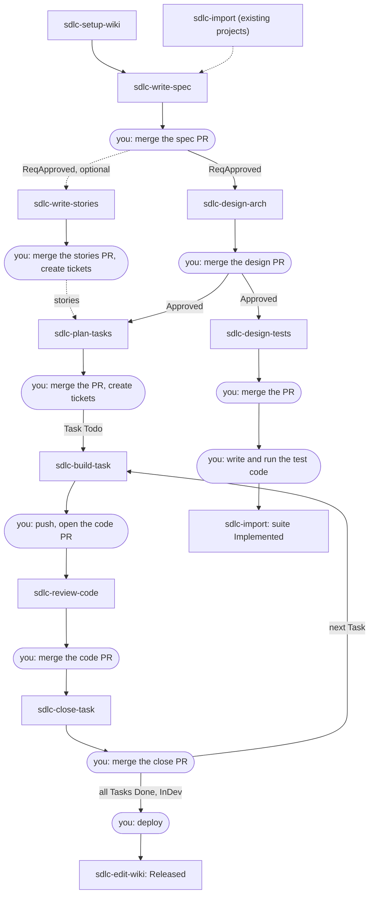

# sdlc-skills user guide

This guide is for everyone on a project that keeps its wiki with the
sdlc-skills: product owners and business analysts, architects, tech leads,
developers, QA and reviewers. The [README](../../README.md) is the short
version. This guide adds one page per skill: when you use it, what it does,
what you do, and what happens in the situations you will meet.

Read this page once to learn the flow. Then open the page of the skill you are
about to run.

## What you are working with

The skills keep a project's requirements, designs, tasks and tests in a **wiki**
of plain Markdown files. The wiki lives in its own git repository. A skill is
an instruction set your AI agent follows: you ask in plain words ("write the
spec for gift cards"), and the agent does the work in steps and stops to ask
you.

Two rules hold for every skill:

- **Every wiki change is a draft.** A skill writes its changes on a branch of
  the wiki repository (for example `wiki/spec-FEAT-gift-cards`) and stops. You
  open the pull request and merge it. The next skill only sees the work after
  the merge.
- **You decide.** A skill asks, recommends and waits for an explicit "yes". It
  never merges, pushes to `main`, opens a pull request, runs tests, deploys or
  touches your ticket tracker. Those steps are yours.

## Install the skills and set up the wiki

Clone the repository once and install the skills for your agent:

```bash
git clone https://github.com/ntanh1402/sdlc-skills
sdlc-skills/install-skills.sh --agent claude            # no arguments lists the agent names
```

Skills need Python 3.11 or newer and git. To update, run `git pull` in the
clone and run the script again (with `--link` the script links instead of
copying, so `git pull` alone updates).

Then, in the folder you work in (your *workspace*, usually a code repository),
ask the agent to set up the wiki. See [sdlc-setup-wiki](sdlc-setup-wiki.md).

## The flow

### The development cycle

Each phase names the skill, who usually runs it, and what you do by hand
afterwards. Click a skill for its guide.

| Phase | Who | Skill | Wiki status afterwards | You do by hand |
|---|---|---|---|---|
| Setup, once per project | Tech lead | [sdlc-setup-wiki](sdlc-setup-wiki.md) | A wiki repository, linked to your workspace | Push the new wiki repository to your git host |
| Onboarding, existing projects only | Tech lead, architect | [sdlc-import](sdlc-import.md), once per code folder, document or test suite | `Released` Features, as-built Design files | Merge each import pull request |
| Requirements | BA / PO | [sdlc-write-spec](sdlc-write-spec.md) | Feature `ReqApproved` (a ChangeRequest: `ReqApproved`) | Merge the spec pull request |
| Design | Architect | [sdlc-design-arch](sdlc-design-arch.md) | `Approved` | Merge the design pull request |
| User stories, optional | BA / PO | [sdlc-write-stories](sdlc-write-stories.md), alongside design | User stories (`STORY-…`) | Merge the stories pull request, create a ticket per story from its paste-ready copy |
| Planning | Tech lead | [sdlc-plan-tasks](sdlc-plan-tasks.md) | Tasks `Todo` | Merge the pull request, create the tracker tickets |
| Test design | QA | [sdlc-design-tests](sdlc-design-tests.md), alongside planning | TestSuites `Approved` | Merge the pull request |
| Implementation | Developer | [sdlc-build-task](sdlc-build-task.md), once per Task | Unchanged (it writes code, not the wiki) | Push the code branch, open the pull request |
| Code review | Reviewer | [sdlc-review-code](sdlc-review-code.md) | Unchanged (read-only) | Decide on the findings, merge the code pull request |
| Closing a Task | Developer | [sdlc-close-task](sdlc-close-task.md) | Task `Done`; Feature `InDev`, or ChangeRequest `Implemented` once all its Tasks are `Done` | Merge the close pull request |
| Testing | QA, developers | Your usual tools | Unchanged | Write the test code from the TestCases and run it in CI. Then `sdlc-import` on the test code marks a suite `Implemented` |
| Release | Release manager | Your usual tools, then [sdlc-edit-wiki](sdlc-edit-wiki.md) | Feature `Released` | Deploy. Then ask `sdlc-edit-wiki` to mark the Feature released |
| Maintenance | Anyone | `sdlc-write-spec`, `sdlc-import`, `sdlc-edit-wiki` | A new ChangeRequest, or corrections | See below |

**Maintenance.** A bug, a security fix or any change to a released Feature is a
new ChangeRequest from `sdlc-write-spec`, and it goes through the same phases
from Design on. When the wiki and the code no longer agree, run `sdlc-import`
on the code folder: it compares the two and you decide each difference. A typo
or a glossary change goes to `sdlc-edit-wiki`.

Two skills are not part of the sequence and can be used at any time:

- [sdlc-ask-wiki](sdlc-ask-wiki.md) answers questions from the wiki and changes
  nothing.
- [sdlc-convert-doc](sdlc-convert-doc.md) turns a PDF, Word, slide or sheet file
  into Markdown, before `sdlc-write-spec` or `sdlc-import` reads it.

One person can play several roles. The roles only tell you which rows are
yours.

### The flow in one picture



Rectangles are skills. Rounded boxes are steps you do yourself.

### Which skill is mine

| Your role | Skills you run | Skills you will meet |
|---|---|---|
| Product owner, business analyst | [write-spec](sdlc-write-spec.md), [write-stories](sdlc-write-stories.md), [convert-doc](sdlc-convert-doc.md) | [ask-wiki](sdlc-ask-wiki.md) to check status |
| Architect | [design-arch](sdlc-design-arch.md), [import](sdlc-import.md) (architecture documents) | [ask-wiki](sdlc-ask-wiki.md) to read a design |
| Tech lead | [setup-wiki](sdlc-setup-wiki.md), [import](sdlc-import.md), [plan-tasks](sdlc-plan-tasks.md) | [edit-wiki](sdlc-edit-wiki.md) to record ticket links |
| QA | [design-tests](sdlc-design-tests.md), [import](sdlc-import.md) (test suites) | [ask-wiki](sdlc-ask-wiki.md) for coverage |
| Developer | [build-task](sdlc-build-task.md), [close-task](sdlc-close-task.md) | [review-code](sdlc-review-code.md) before the merge |
| Reviewer | [review-code](sdlc-review-code.md) | [ask-wiki](sdlc-ask-wiki.md) for the Task and its design |
| Release manager | [edit-wiki](sdlc-edit-wiki.md) | [ask-wiki](sdlc-ask-wiki.md) for what is not built |

### In a Scrum team

`sdlc-write-spec`, `sdlc-write-stories` and `sdlc-design-arch` belong to backlog
refinement: a Feature is ready for a sprint when its design is merged, and its
stories are the backlog items. `sdlc-plan-tasks` and `sdlc-design-tests` belong
to sprint planning, and their Tasks become your tickets. `sdlc-build-task`,
`sdlc-review-code` and `sdlc-close-task` run inside the sprint, once for each
Task. Marking a Feature released goes with your release.

### The terms you need

| Term | Means |
|---|---|
| Feature (`FEAT-…`) | A capability of an Application: its PRD, Requirements and Architecture. Statuses: `Draft` → `ReqApproved` → `Approved` → `InDev` → `Released` (later `Deprecated`) |
| ChangeRequest (`CR-…`) | A change to one Feature that is already `Approved` or later. Statuses: `Proposed` → `ReqApproved` → `Approved` → `Implemented` (or `Rejected`) |
| Requirement (`REQ-…`) | One testable requirement inside a Feature or ChangeRequest |
| Design files | Services, endpoints, events, tables, frontends and externals. A design not built yet is marked as pending (`Planned`, `Modifying`, `Removing`) until its Task is closed |
| User story (`STORY-…`) | One actor's goal: "As a …, I want …, so that …" with Given/When/Then criteria, each citing a Requirement. Optional; no status, you follow it in your tracker |
| Task (`TASK-…`) | One piece of build work. Only `Todo` or `Done`; you follow progress in your tracker, not in the wiki |
| TestSuite (`TS-…`), TestCase (`TC-…`) | The test design. A suite is `Implemented` once its test code exists |
| Draft | One skill run's changes, on a branch `wiki/<step>-<key>` of the wiki repository. The next step only sees it after you merge its pull request |
| Workspace | The folder you start your agent in, usually a code repository. `sdlc-setup-wiki` links it to the wiki |

More terms are in [CONTEXT.md](../../CONTEXT.md).

## How a skill run goes

To run a skill, ask your agent in plain words ("write the spec for gift
cards"), or call it by name (in Claude Code, `/sdlc-write-spec`). Start the
agent in your workspace.

Every skill that writes the wiki runs the same way, and each skill page
assumes you know this:

1. **It reads the wiki first**, so it does not ask what the wiki already says.
2. **It asks questions in rounds.** Each question is numbered and comes with a
   recommended answer and the wiki file behind it. Reply by number, for example
   `1 ok, 2 ok, 3: only registered customers`. You get at least one round, even
   when your request seems complete. One question is always the same: *what
   else in the wiki must change because of this?*
3. **It stops three times for your approval:**
   - **Intent:** what will be done (the target, the scope).
   - **Design:** how. The full PRD, architecture, task plan or test design,
     plus the list of files it will change.
   - **Change-set:** the exact diff and the commit message, before anything is
     committed.

   Approval means an explicit "yes". "Sounds good" or "whatever you think" does
   not count. Asking for an edit at a gate sends the skill back to that gate. If
   you say "don't ask me, just write it", the skill stops and lists the
   decisions it still needs from you.
4. **It checks its own work**, then commits the draft and pushes its branch.
5. **It ends with at most four lines:** what was done, what was not, anything
   another skill must handle, and the next step.

   ```text
   Done: wiki/arch-FEAT-gift-cards, 6 files, pushed. Open the pull request.
   Next: sdlc-plan-tasks and sdlc-design-tests after the merge.
   ```

**If a run stops part-way,** run the same skill again. It finds its unfinished
draft, shows its plan, asks whether the plan still stands, and continues from
the first unfinished file.

**A change another skill owns.** When your answers need a change the running
skill does not own (a missing requirement found while designing, for example),
the skill does not make it. It lists the change under "For other skills" and,
if it cannot go on without it, stops and names the skill to run first.

**Short form.** `sdlc-close-task` and `sdlc-edit-wiki` ask only when something
is unclear, and stop once to show the exact change and once for the change set.
`sdlc-ask-wiki` and `sdlc-review-code` are read-only and ask nothing unless
something is missing.

## The skills

In the order of the flow. Each page has the same parts: *At a glance*, *What the
skill does*, *What you do*, *Scenarios* (what can happen, what the skill does,
what you do), and *Not this skill*.

| Skill | One line |
|---|---|
| [sdlc-setup-wiki](sdlc-setup-wiki.md) | Create or upgrade the wiki repository, link a folder to it, add an Application |
| [sdlc-convert-doc](sdlc-convert-doc.md) | Turn a PDF, scan, Word, slide or sheet file into Markdown |
| [sdlc-import](sdlc-import.md) | Bring an existing system (code, documents, tests) into the wiki, or compare it with the wiki |
| [sdlc-write-spec](sdlc-write-spec.md) | Write a Feature's or ChangeRequest's PRD and Requirements |
| [sdlc-write-stories](sdlc-write-stories.md) | Break approved Requirements into user stories |
| [sdlc-design-arch](sdlc-design-arch.md) | Design the architecture of approved requirements |
| [sdlc-plan-tasks](sdlc-plan-tasks.md) | Plan the build Tasks of an approved design |
| [sdlc-design-tests](sdlc-design-tests.md) | Design TestSuites and TestCases of an approved design |
| [sdlc-build-task](sdlc-build-task.md) | Write the code and unit tests of one Task, on a branch |
| [sdlc-review-code](sdlc-review-code.md) | Review a code change against the wiki, read-only |
| [sdlc-close-task](sdlc-close-task.md) | Record in the wiki that a Task's code is merged |
| [sdlc-edit-wiki](sdlc-edit-wiki.md) | Small edits no other skill owns: typos, glossary, released, ticket links |
| [sdlc-ask-wiki](sdlc-ask-wiki.md) | Answer questions from the wiki, read-only |

## When a skill says no

Skills refuse rather than guess. The common refusals:

| The skill says | It means | Do |
|---|---|---|
| No project wiki is linked to this folder | Your workspace has no note pointing to the wiki | Run `sdlc-setup-wiki` in this folder |
| The wiki's tool is older than this skill | You updated the skills, but not the wiki | Run `sdlc-setup-wiki` to upgrade the wiki, then merge its draft |
| The wiki was set up by a newer release | Someone upgraded the wiki with newer skills | Update your installed skills (`git pull`, then `install-skills.sh` again) |
| The wiki's tool copy was edited by hand | Files in `.wiki-llm/` were changed | Run `sdlc-setup-wiki` to restore them |
| `<Key>` is in draft `wiki/…`, not on `main` | The previous step's pull request is not merged | Merge it, then run the skill again |
| The requirements are not approved for design | The Feature is still `Draft` | Approve the requirements with `sdlc-write-spec` |
| A change to the design is a new ChangeRequest | The Feature is already designed | `sdlc-write-spec` writes a ChangeRequest |
| This is already built; use sdlc-import | Your brief describes something that already runs | `sdlc-import` records it |
| The Application does not exist | No such Application in the wiki | `sdlc-setup-wiki`: "add application `<key>`" |
| The Task is `Done` | Its code is already merged | A further change is a new Task or a ChangeRequest |

A wiki pull request can conflict when two drafts change the same files, for
example the tasks and the tests of one Feature. Merge one, then ask your agent
to run the tool's `refresh` on the other draft, and merge that one.

## More

- [README](../../README.md): the short version.
- [docs/runbook.md](../runbook.md): the wiki repository, the tool's commands and
  how to change a wiki by hand.
- [CONTEXT.md](../../CONTEXT.md): the terms used here.
- [docs/adr/](../adr/): the decisions behind the design.
