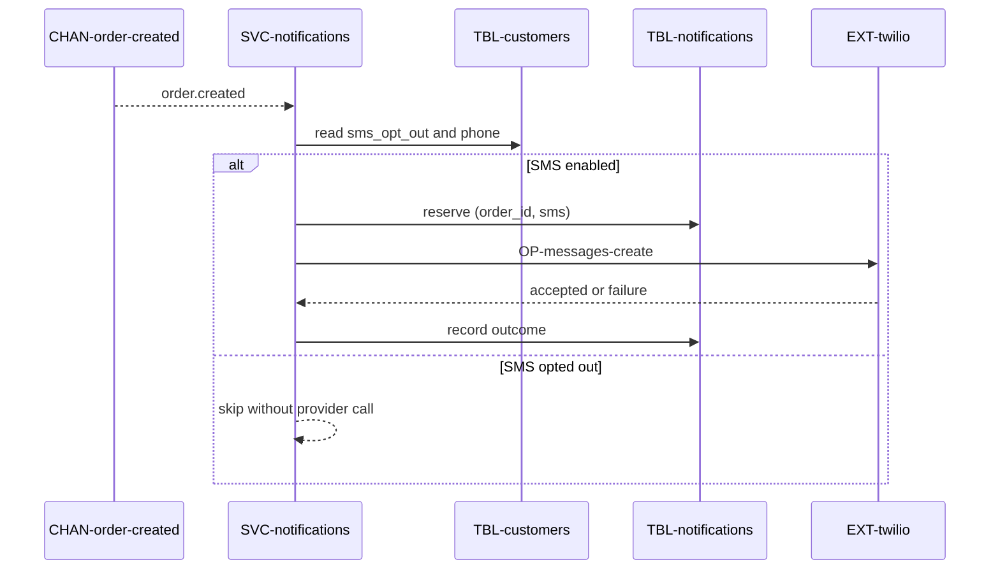

# Add SMS as a second notification channel

Jira `SHOP-210`.

# Changes

* [FEAT-order-notifications](../../features/FEAT-order-notifications/overview.md) — its `# Architecture` already reflects this delta; read it for current state.

# Reason

Email confirmations open at under 40%. "Did my order go through?" is the top
support contact driver. SMS is opt-in, capped, and cheap relative to a support
contact.

Rejected alternative: a push notification. It needs the mobile app, which most
shoppers do not have.

# Requirements

### REQ-order-notifications-channel-opt-out

**Should** — A customer who has opted out of a channel is not contacted on it.
Constraint. Verified by test. *(Added by this CR; it now lives in the feature.)*

# Delta

## Target delta

* [EXT-twilio](../../externals/EXT-twilio/overview.md) — new — the SMS provider.
* [OP-messages-create](../../externals/EXT-twilio/OP-messages-create.md) — new — the one call we make on it.
* [SVC-notifications](../../services/SVC-notifications/overview.md) — modified — a second send path, and a `# Calls` link to the Twilio operation.
* [SUB-order-created](../../services/SVC-notifications/SUB-order-created.md) — modified — the handler loops over channels instead of sending one email.
* [TBL-notifications](../../datastores/DB-shop/TBL-notifications.md) — modified — `channel` gains the value `sms`. No migration: the unique index on `(order_id, channel)` already made a second channel safe.
* [TBL-customers](../../datastores/DB-shop/TBL-customers.md) — modified — `phone` and `sms_opt_out` columns.

**Impact.** One new external dependency and one extra row per order. No change to
`SVC-orders` or
[FEAT-checkout](../../features/FEAT-checkout/overview.md) — the event boundary is
why: the producer does not know who consumes the event, so adding a consumer
channel touches nothing upstream.

## Runtime sequences

## Decisions

* [ADR-twilio-for-sms](../../decisions/ADR-twilio-for-sms.md) — use Twilio behind the existing provider boundary.

## Traceability

| Requirement/change | Target concepts |
|---|---|
| [REQ-order-notifications-channel-opt-out](#req-order-notifications-channel-opt-out) | [TBL-customers](../../datastores/DB-shop/TBL-customers.md), [SVC-notifications](../../services/SVC-notifications/overview.md) |
| SMS provider | [EXT-twilio](../../externals/EXT-twilio/overview.md), [OP-messages-create](../../externals/EXT-twilio/OP-messages-create.md) |
| Idempotent delivery | [SUB-order-created](../../services/SVC-notifications/SUB-order-created.md), [TBL-notifications](../../datastores/DB-shop/TBL-notifications.md) |
