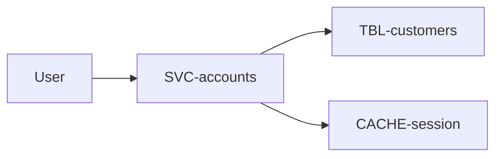
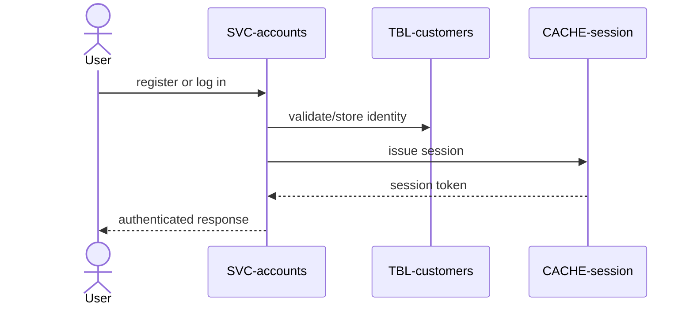

# Accounts

Customer identity for the whole platform: register, log in, and hold the session
every other service authenticates against. Owned by `accounts`. Part of the
[Shop Platform](../../overview.md).

# Requirements

### REQ-accounts-register

**Must** — A visitor can register with an email and a strong password.
Functional. Verified by test.

### REQ-accounts-login-session

**Must** — A registered customer can log in and receive a session valid for 24
hours. Functional. Verified by test.

### REQ-accounts-credential-safety

**Must** — Passwords are stored only as salted hashes, login is rate-limited, and
errors do not reveal whether an email is registered. Non-functional. Verified by
test.

# Architecture

Approved target state.

## Context and constraints

Credentials and profiles stay in the customer table; session validity has one
cache authority shared by authenticated services.

## High-level architecture

## Services

* [SVC-accounts](../../services/SVC-accounts/overview.md) — registration, login, profile, and session issuance.

## Runtime sequences

## Decisions

None recorded.

## Traceability

| Requirement | Target concepts |
|---|---|
| [REQ-accounts-register](#req-accounts-register) | [SVC-accounts](../../services/SVC-accounts/overview.md), [TBL-customers](../../datastores/DB-shop/TBL-customers.md) |
| [REQ-accounts-login-session](#req-accounts-login-session) | [SVC-accounts](../../services/SVC-accounts/overview.md), [CACHE-session](../../datastores/CACHE-session/overview.md) |
| [REQ-accounts-credential-safety](#req-accounts-credential-safety) | [SVC-accounts](../../services/SVC-accounts/overview.md), [TBL-customers](../../datastores/DB-shop/TBL-customers.md) |

# Change history

None
