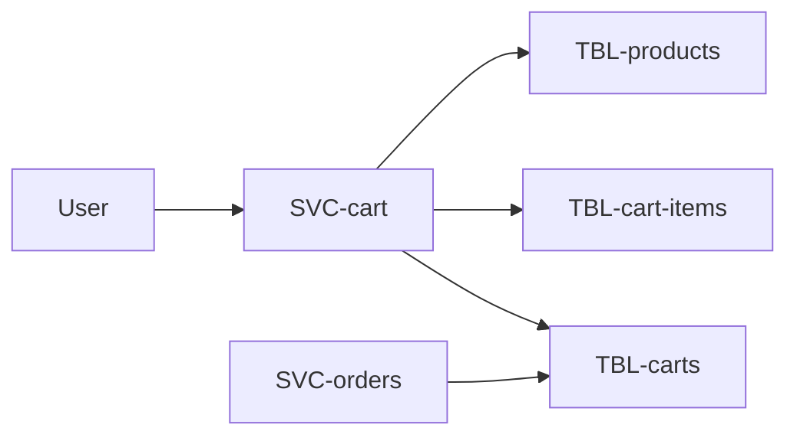
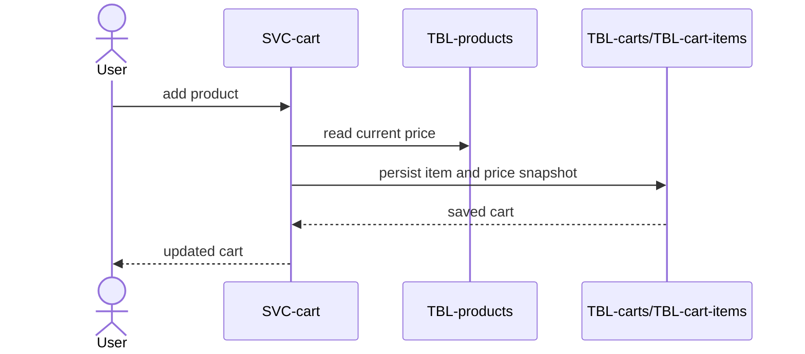

# Cart

The bridge between browsing and buying: add items, adjust quantities, and hold
them until checkout turns the cart into an order. Owned by `checkout`. Part of the
[Shop Platform](../../overview.md).

# Requirements

### REQ-cart-view-total

**Must** — A logged-in customer can view their cart with a running total.
Functional. Verified by test.

### REQ-cart-edit-items

**Must** — A customer can add, change the quantity of, and remove items.
Functional. Verified by test.

### REQ-cart-price-fixed-on-add

**Must** — The price of an item is fixed at the moment it is added, and a later
price change does not alter the cart. Constraint. Verified by test.

# Architecture

Approved target state.

## Context and constraints

Cart owns mutable pre-checkout state and snapshots product price when an item is
added. Checkout reads that snapshot without transferring ownership.

## High-level architecture

## Services

* [SVC-cart](../../services/SVC-cart/overview.md) — owns the cart until checkout.
* [SVC-orders](../../services/SVC-orders/overview.md) — reads the cart during checkout.

## Runtime sequences

## Decisions

None recorded.

## Traceability

| Requirement | Target concepts |
|---|---|
| [REQ-cart-view-total](#req-cart-view-total) | [SVC-cart](../../services/SVC-cart/overview.md), [TBL-carts](../../datastores/DB-shop/TBL-carts.md) |
| [REQ-cart-edit-items](#req-cart-edit-items) | [SVC-cart](../../services/SVC-cart/overview.md), [TBL-cart-items](../../datastores/DB-shop/TBL-cart-items.md) |
| [REQ-cart-price-fixed-on-add](#req-cart-price-fixed-on-add) | [SVC-cart](../../services/SVC-cart/overview.md), [SVC-orders](../../services/SVC-orders/overview.md) |

# Change history

None
