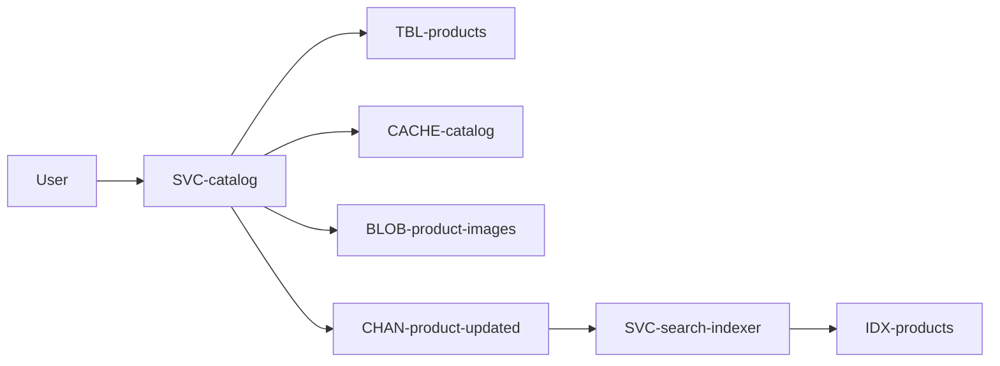
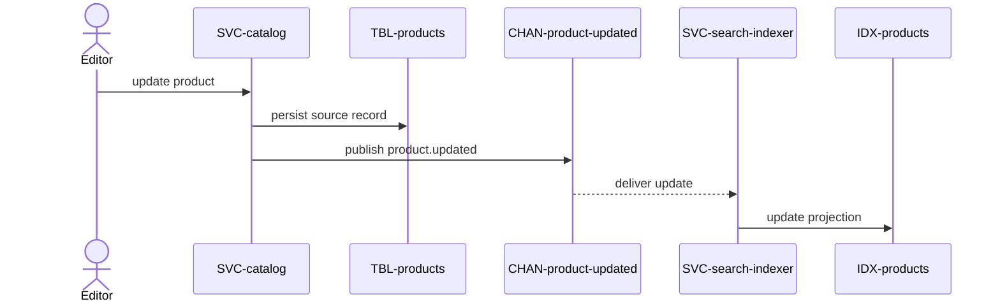

# Catalog

The storefront's read side: browse a category, open a product, search across the
catalog. Owned by `catalog`. Part of the [Shop Platform](../../overview.md).

Reads dwarf writes here, so the design splits the write model (Postgres) from two
derived read models — a cache for point reads and a search index for queries —
kept fresh by events rather than by a nightly rebuild.

# Requirements

### REQ-catalog-browse-by-category

**Must** — A customer can browse products by category, paginated. Functional.
Verified by test.

### REQ-catalog-product-detail

**Must** — A customer can open a product detail page with images and price.
Functional. Verified by test.

### REQ-catalog-keyword-search

**Should** — A customer can search products by keyword and filter by category and
price, with results reflecting a change within a minute. Functional. Verified by
test.

# Architecture

Approved target state.

## Context and constraints

Catalog is source of truth; cache and search are rebuildable projections. Search
may be eventually consistent, while product detail reads must reflect catalog.

## High-level architecture

## Services

* [SVC-catalog](../../services/SVC-catalog/overview.md) — serves reads and owns product writes.
* [SVC-search-indexer](../../services/SVC-search-indexer/overview.md) — projects product changes into search.

## Runtime sequences

## Decisions

None recorded.

## Traceability

| Requirement | Target concepts |
|---|---|
| [REQ-catalog-browse-by-category](#req-catalog-browse-by-category) | [SVC-catalog](../../services/SVC-catalog/overview.md), [CACHE-catalog](../../datastores/CACHE-catalog/overview.md) |
| [REQ-catalog-product-detail](#req-catalog-product-detail) | [SVC-catalog](../../services/SVC-catalog/overview.md), [BLOB-product-images](../../datastores/BLOB-product-images/overview.md) |
| [REQ-catalog-keyword-search](#req-catalog-keyword-search) | [SVC-search-indexer](../../services/SVC-search-indexer/overview.md), [IDX-products](../../datastores/IDX-products/overview.md) |

# Change history

None
