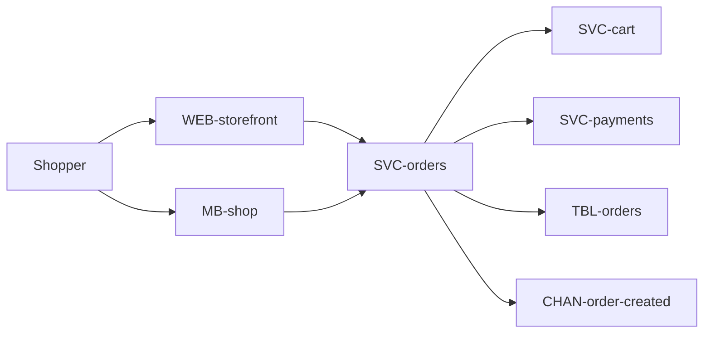
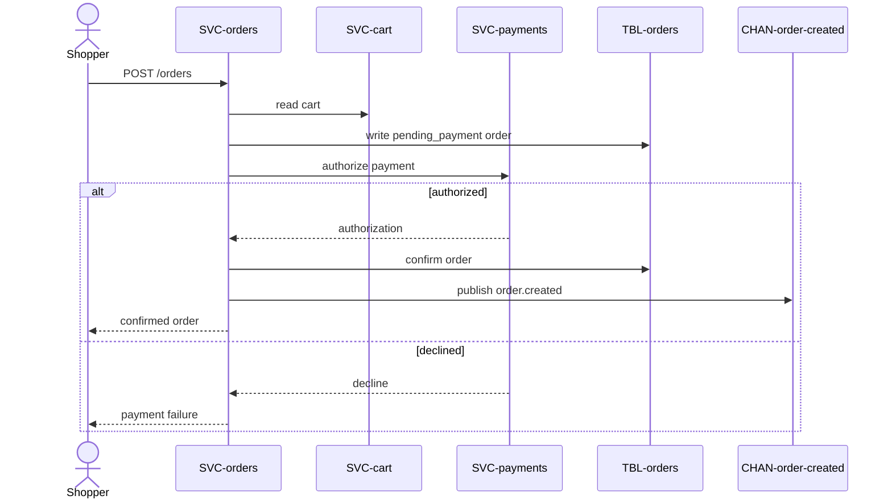

# Checkout

Allow customers to complete a purchase end-to-end. Owned by `payments`. Part of
the [Shop Platform](../../overview.md).

# Requirements

### REQ-checkout-complete-purchase

**Must** — A shopper completes a purchase and receives an order confirmation.
Functional. Verified by test.

### REQ-checkout-pay-before-confirm

**Must** — Payment is taken before the order is confirmed, and a retried checkout
never creates a second order or a second charge. Functional. Verified by test.

# Architecture

Approved target state.

## Context and constraints

Payment authorization must succeed before confirmation. Checkout is idempotent,
and asynchronous notification failure must not fail purchase.

## High-level architecture

## Services

* [SVC-orders](../../services/SVC-orders/overview.md) — owns checkout orchestration and order state.
* [SVC-cart](../../services/SVC-cart/overview.md) — supplies the source cart.
* [SVC-payments](../../services/SVC-payments/overview.md) — authorizes payment synchronously.

## Frontends

* [WEB-storefront](../../frontends/WEB-storefront/overview.md) — browser checkout route and order confirmation.
* [MB-shop](../../frontends/MB-shop/overview.md) — iOS and Android checkout screens.

## Runtime sequences

## Decisions

* [ADR-idempotent-checkout — Make checkout creation idempotent](../../decisions/ADR-idempotent-checkout.md)

## Traceability

| Requirement | Target concepts |
|---|---|
| [REQ-checkout-complete-purchase](#req-checkout-complete-purchase) | [WEB-storefront](../../frontends/WEB-storefront/overview.md), [MB-shop](../../frontends/MB-shop/overview.md), [EP-orders-create](../../services/SVC-orders/EP-orders-create.md), [TBL-orders](../../datastores/DB-shop/TBL-orders.md), [CHAN-order-created](../../channels/CHAN-order-created/overview.md) |
| [REQ-checkout-pay-before-confirm](#req-checkout-pay-before-confirm) | [SVC-orders](../../services/SVC-orders/overview.md), [SVC-payments](../../services/SVC-payments/overview.md) |

# Change history

None
