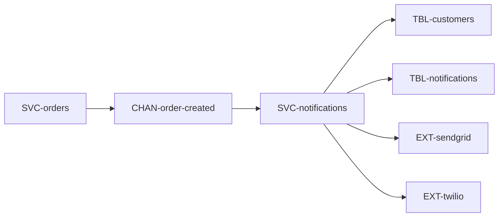
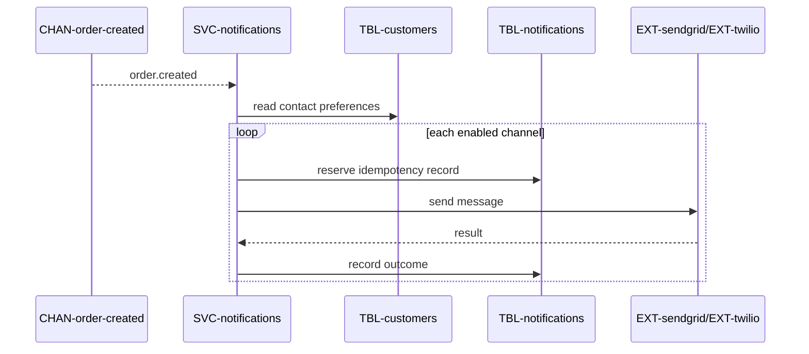

# Order Notifications

When an order is placed, tell the customer — by email, and (since [CR-sms-notifications](../../change-requests/CR-sms-notifications/overview.md))
by SMS. Owned by `growth`. Part of the [Shop Platform](../../overview.md).

Deliberately **not** part of [Checkout](../FEAT-checkout/overview.md): checkout
publishes an event and is done. Notification failure must never fail a purchase.

# Requirements

### REQ-order-notifications-confirmation-sent

**Must** — A customer receives an order confirmation within 60 seconds of the
order being created. Functional. Verified by test.

### REQ-order-notifications-failure-never-blocks

**Must** — A notification that fails to send is retried, and never blocks or
fails the purchase. Non-functional. Verified by test.

### REQ-order-notifications-channel-opt-out

**Should** — A customer who has opted out of a channel is not contacted on it.
Constraint. Verified by test.

# Architecture

Approved target state.

## Context and constraints

Notification providers must remain outside checkout's success boundary. Delivery
is opt-in by channel and retries must be idempotent.

## High-level architecture

## Services

* [SVC-notifications](../../services/SVC-notifications/overview.md) — consumes order events and sends enabled channels.

## Runtime sequences

## Decisions

* [ADR-twilio-for-sms — Use Twilio for SMS delivery](../../decisions/ADR-twilio-for-sms.md)

## Traceability

| Requirement | Target concepts |
|---|---|
| [REQ-order-notifications-confirmation-sent](#req-order-notifications-confirmation-sent) | [SVC-notifications](../../services/SVC-notifications/overview.md), [EXT-sendgrid](../../externals/EXT-sendgrid/overview.md) |
| [REQ-order-notifications-failure-never-blocks](#req-order-notifications-failure-never-blocks) | [TBL-notifications](../../datastores/DB-shop/TBL-notifications.md), [CHAN-order-created](../../channels/CHAN-order-created/overview.md) |
| [REQ-order-notifications-channel-opt-out](#req-order-notifications-channel-opt-out) | [TBL-customers](../../datastores/DB-shop/TBL-customers.md), [EXT-twilio](../../externals/EXT-twilio/overview.md) |

# Change history

* [Add SMS as a second notification channel](../../change-requests/CR-sms-notifications/overview.md)
