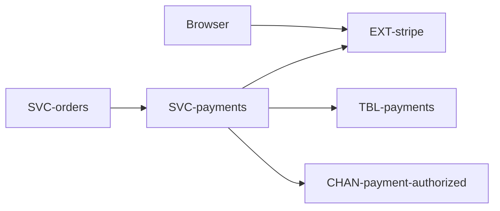
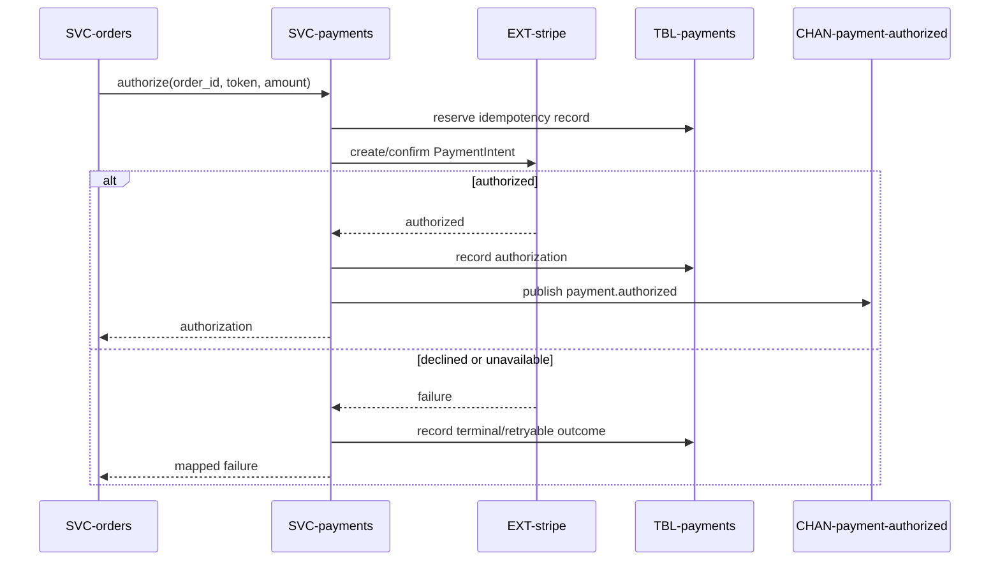

# Payments

Charge the customer's card during checkout, and capture the charge when the order
ships — all without card data ever entering the platform. Owned by `payments`.
Part of the [Shop Platform](../../overview.md).

# Requirements

### REQ-payments-no-card-data

**Must** — Card details never reach the platform; only a provider token is
handled. Constraint. Verified by inspection.

### REQ-payments-authorize-once

**Must** — A charge is authorized during checkout, and a retried checkout never
double-charges. Functional. Verified by test.

### REQ-payments-capture-at-fulfilment

**Should** — A charge is captured only at fulfilment; a cancelled order releases
the authorization. Functional. Verified by test.

# Architecture

Approved target state.

## Context and constraints

Card details never enter application services. `order_id` is the idempotency key
and Stripe failures must map to stable internal outcomes.

## High-level architecture

## Services

* [SVC-payments](../../services/SVC-payments/overview.md) — authorizes and captures through Stripe.
* [SVC-orders](../../services/SVC-orders/overview.md) — requests authorization during checkout.

## Runtime sequences

## Decisions

None recorded.

## Traceability

| Requirement | Target concepts |
|---|---|
| [REQ-payments-no-card-data](#req-payments-no-card-data) | [SVC-payments](../../services/SVC-payments/overview.md), [EXT-stripe](../../externals/EXT-stripe/overview.md) |
| [REQ-payments-authorize-once](#req-payments-authorize-once) | [TBL-payments](../../datastores/DB-shop/TBL-payments.md), [CHAN-payment-authorized](../../channels/CHAN-payment-authorized/overview.md) |
| [REQ-payments-capture-at-fulfilment](#req-payments-capture-at-fulfilment) | [SVC-payments](../../services/SVC-payments/overview.md), [SVC-orders](../../services/SVC-orders/overview.md) |

# Change history

None
