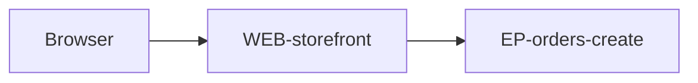

# Shop Web Storefront

Customer-facing browser application. Server rendering supplies the initial
catalog shell; authenticated cart and checkout state load after session
validation.

# Routes

| Route | Surface | Access | Description |
|---|---|---|---|
| `/` | Catalog | public | Browse featured products and categories. |
| `/cart` | Cart | authenticated | Review quantities and order total. |
| `/checkout` | Checkout | authenticated | Confirm delivery details and submit the order. |
| `/orders/{orderId}` | Order confirmation | authenticated | Show confirmed order status. |

# Architecture

Next.js owns routing and server-rendered shells. Client modules own transient
form state; API responses remain source of truth for cart and order state.

# Calls

* [EP-orders-create](../../services/SVC-orders/EP-orders-create.md) — submits checkout. The page disables repeat submission while loading, redirects to order confirmation on success, and keeps entered delivery data while showing a retryable error on failure.

# Runtime behavior

Navigation uses framework routing with authenticated route guards. Server state
is cached per user and invalidated after mutations; form state remains local.
Expired sessions redirect to login with the intended return URL. Empty carts
show recovery guidance, loading states preserve layout, and failed requests keep
the last valid state while offering retry.

# Quality constraints

Support last two major versions of Chrome, Edge, Firefox, and Safari at 360px
through 1920px viewports. Meet WCAG 2.2 AA. Keep p75 LCP below 2.5s, INP below
200ms, and CLS below 0.1 on production traffic.
