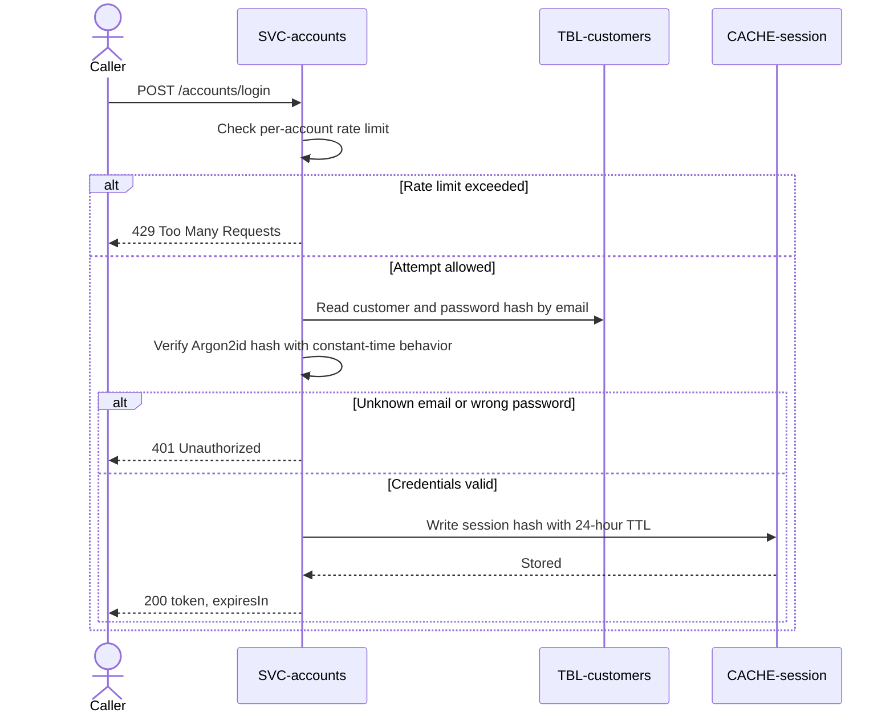

# Log in

`POST /accounts/login`, exposed by
[SVC-accounts](overview.md). Verifies credentials and
returns a session token, which it writes into
[CACHE-session](../../datastores/CACHE-session/overview.md). Satisfies
[REQ-accounts-login-session](../../features/FEAT-accounts/overview.md#req-accounts-login-session).

# Request

| Field | Location | Type | Required | Description |
|---|---|---|---|---|
| `email` | body | string | yes | Account email. |
| `password` | body | string | yes | Account password. |

# Response

| Field | Status | Type | Required | Description |
|---|---|---|---|---|
| `token` | 200 | string | yes | Opaque session token. |
| `expiresIn` | 200 | integer | yes | Session lifetime in seconds. |

Responses `401` and `429` have no response body.

## Status codes

| Code | When |
|---|---|
| 200 | authenticated; token returned |
| 401 | bad credentials (indistinguishable for unknown email vs wrong password) |
| 429 | too many attempts for this account |

# Behavior

Verifies the Argon2id hash and, on success, writes a session hash to
[CACHE-session](../../datastores/CACHE-session/overview.md) with a 24-hour TTL. A
bad email and a bad password return the **same** `401` and take the same time —
no user enumeration. Login is rate-limited per account (5/min) to blunt
credential-stuffing.

# Sequence diagram

