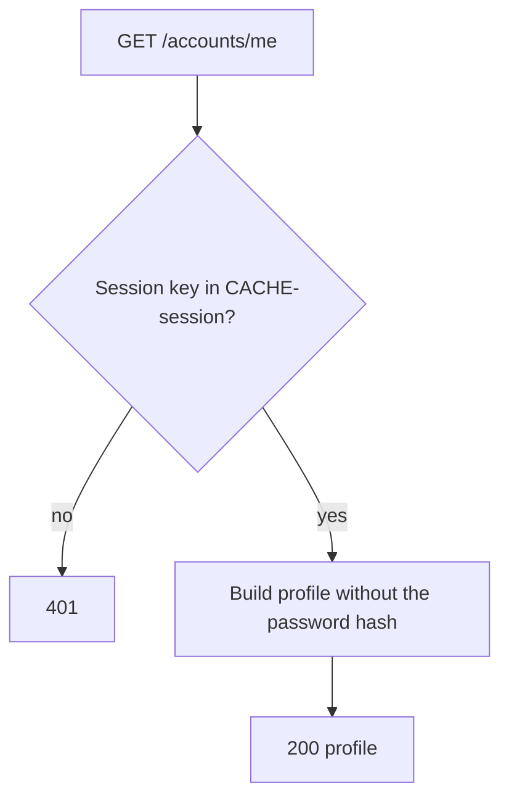
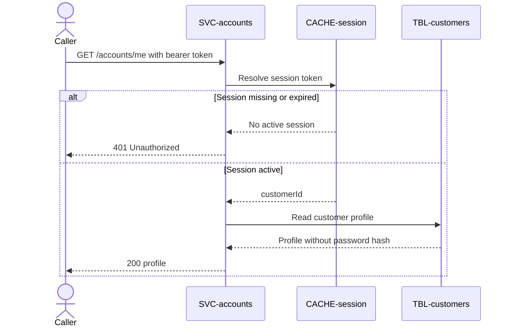

# Get profile

`GET /accounts/me`, exposed by
[SVC-accounts](overview.md). Returns the profile of
the session holder. This is the endpoint that turns a token into an identity, so
it is the read path
[CACHE-session](../../datastores/CACHE-session/overview.md) exists to serve.

# Request

| Field | Location | Type | Required | Description |
|---|---|---|---|---|
| `Authorization` | header | bearer token | yes | Session token. |

# Response

| Field | Status | Type | Required | Description |
|---|---|---|---|---|
| `customerId` | 200 | string (uuid) | yes | Authenticated customer. |
| `email` | 200 | string | yes | Customer email. |
| `emailOptOut` | 200 | boolean | yes | Email notification preference. |
| `smsOptOut` | 200 | boolean | yes | SMS notification preference. |

Response `401` has no response body.

## Status codes

| Code | When |
|---|---|
| 200 | profile returned |
| 401 | missing or expired session |

# Validations

| Rule | Fails with |
|---|---|
| `Authorization` carries a session token present in CACHE-session | `401` |

# Behavior

Reads the session from
[CACHE-session](../../datastores/CACHE-session/overview.md); a missing key is an
expired or revoked session and returns `401`. The password hash is **never** in
the response.

# Flowchart

# Sequence diagram

