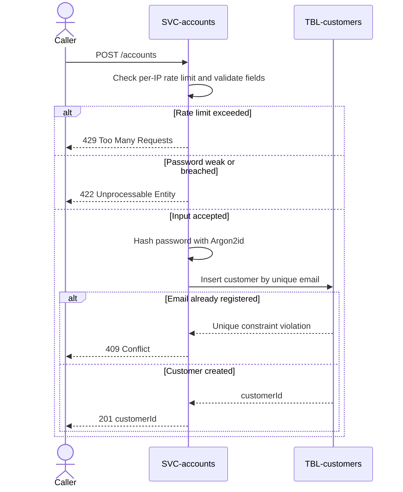

# Register account

`POST /accounts`, exposed by
[SVC-accounts](overview.md). Creates a customer with
an email and a password. Satisfies
[REQ-accounts-register](../../features/FEAT-accounts/overview.md#req-accounts-register).

# Request

| Field | Location | Type | Required | Description |
|---|---|---|---|---|
| `email` | body | string | yes | New account email. |
| `password` | body | string | yes | New account password. |

# Response

| Field | Status | Type | Required | Description |
|---|---|---|---|---|
| `customerId` | 201 | string (uuid) | yes | Created customer. |

Responses `409`, `422`, and `429` have no response body.

## Status codes

| Code | When |
|---|---|
| 201 | account created |
| 409 | email already registered |
| 422 | weak or breached password |
| 429 | too many attempts from this IP |

# Validations

| Field | Constraint |
|---|---|
| `email` | RFC 5322, unique in [customers](../../datastores/DB-shop/TBL-customers.md) |
| `password` | ≥ 12 chars; checked against a breached-password list |

# Behavior

Hashes the password with Argon2id and writes the row. On a duplicate email it
returns `409` **without** revealing whether the address was already registered in
the response timing — the same work is done either way, so registration cannot be
used to enumerate accounts.

# Sequence diagram

