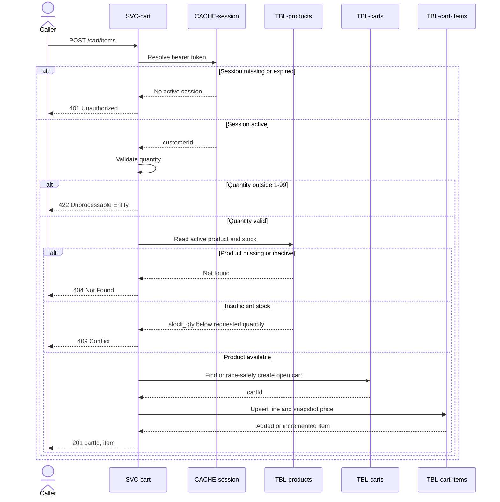

# Add cart item

`POST /cart/items`, exposed by
[SVC-cart](overview.md). Adds a product to the cart, or
increments the quantity if it is already there. Satisfies
[REQ-cart-edit-items](../../features/FEAT-cart/overview.md#req-cart-edit-items).

# Request

| Field | Location | Type | Required | Description |
|---|---|---|---|---|
| `Authorization` | header | bearer token | yes | Session token. |
| `productId` | body | string (uuid) | yes | Product to add. |
| `quantity` | body | integer | no | Quantity to add; defaults to 1. |

# Response

| Field | Status | Type | Required | Description |
|---|---|---|---|---|
| `cartId` | 201 | string (uuid) | yes | Open cart. |
| `item` | 201 | object | yes | Added or updated cart line. |

Responses `401`, `404`, `409`, and `422` have no response body.

## Status codes

| Code | When |
|---|---|
| 201 | line added or incremented |
| 401 | missing or expired session |
| 404 | no such product |
| 409 | insufficient stock |
| 422 | quantity out of range |

# Validations

| Field | Constraint |
|---|---|
| `productId` | must be an `active` product in [products](../../datastores/DB-shop/TBL-products.md) |
| `quantity` | 1–99 |
| stock | requested quantity ≤ `stock_qty`, else 409 |

# Behavior

Creates the open cart on first add (the partial unique index on
[carts](../../datastores/DB-shop/TBL-carts.md) makes the create race-safe), then
upserts the line, snapshotting `price_usd` into `unit_price_usd`. Adding the same
product twice increments quantity via the unique index on
[cart_items](../../datastores/DB-shop/TBL-cart-items.md) — it never creates a
duplicate line.

# Sequence diagram

