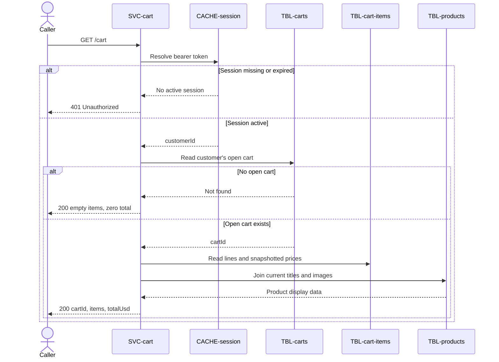

# Get cart

`GET /cart`, exposed by [SVC-cart](overview.md). Returns
the caller's open cart with each line re-joined to the current product for title
and image, but priced at the snapshot in
[cart_items](../../datastores/DB-shop/TBL-cart-items.md). Satisfies
[REQ-cart-view-total](../../features/FEAT-cart/overview.md#req-cart-view-total).

# Request

| Field | Location | Type | Required | Description |
|---|---|---|---|---|
| `Authorization` | header | bearer token | yes | Session token. |

# Response

| Field | Status | Type | Required | Description |
|---|---|---|---|---|
| `cartId` | 200 | string (uuid) | yes | Cart identifier. |
| `items` | 200 | array of `{ productId, title, quantity, unitPriceUsd, lineTotalUsd }` | yes | Current lines; empty when no open cart exists. |
| `totalUsd` | 200 | number | yes | Sum of line totals; zero for an empty cart. |

Response `401` has no response body.

## Status codes

| Code | When |
|---|---|
| 200 | cart returned (possibly empty) |
| 401 | missing or expired session |

# Behavior

Resolves the session via
[CACHE-session](../../datastores/CACHE-session/overview.md). If the customer has
no open cart, returns `200` with an empty cart rather than `404` — an empty cart
is a valid state, not a missing resource.

# Sequence diagram

