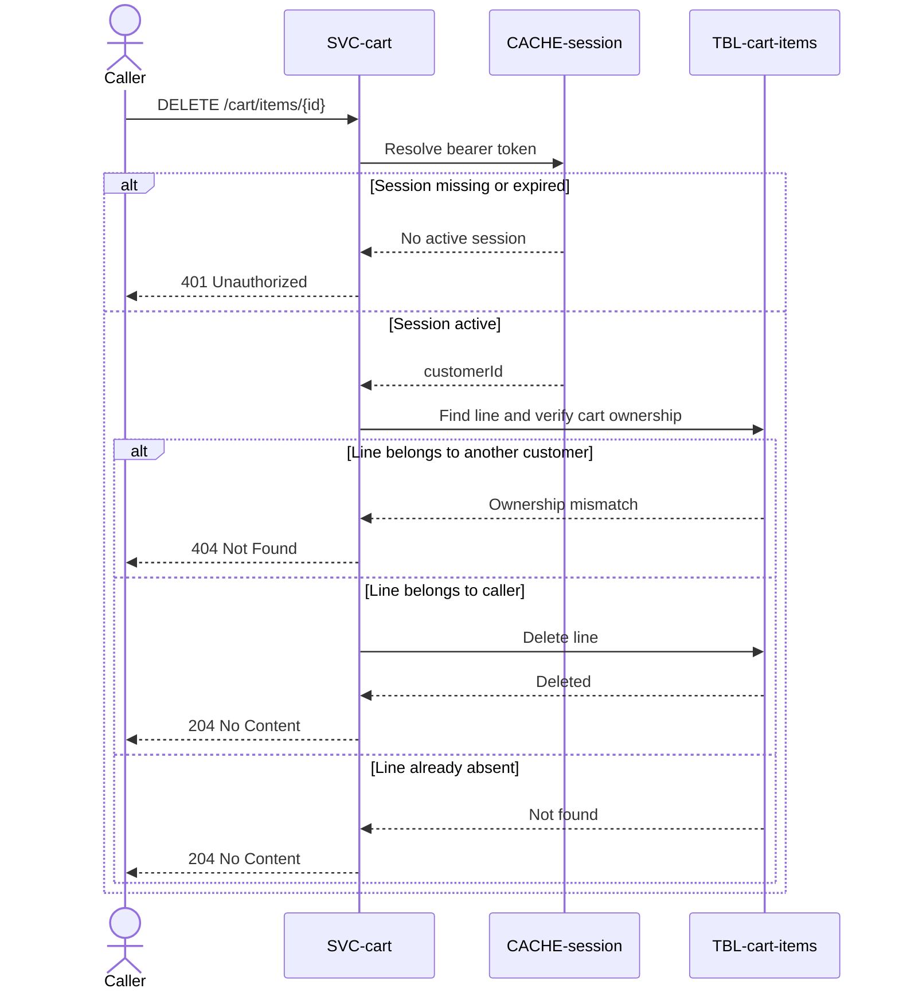

# Remove cart item

`DELETE /cart/items/{id}`, exposed by
[SVC-cart](overview.md). Removes one line from the
caller's cart. Idempotent: deleting a line that is already gone returns `204`, not
`404`, so a double-tap on "remove" is harmless.

# Request

| Field | Location | Type | Required | Description |
|---|---|---|---|---|
| `Authorization` | header | bearer token | yes | Session token. |
| `id` | path | string (uuid) | yes | `cart_item_id` to remove. |

# Response

Responses `204`, `401`, and `404` have no response body.

## Status codes

| Code | When |
|---|---|
| 204 | removed, or already absent |
| 401 | missing or expired session |
| 404 | line id not in the caller's cart |

# Behavior

Deletes the row from [cart_items](../../datastores/DB-shop/TBL-cart-items.md) only
if it belongs to the caller's cart — a line id from someone else's cart returns
`404`, never a cross-customer delete.

# Sequence diagram

