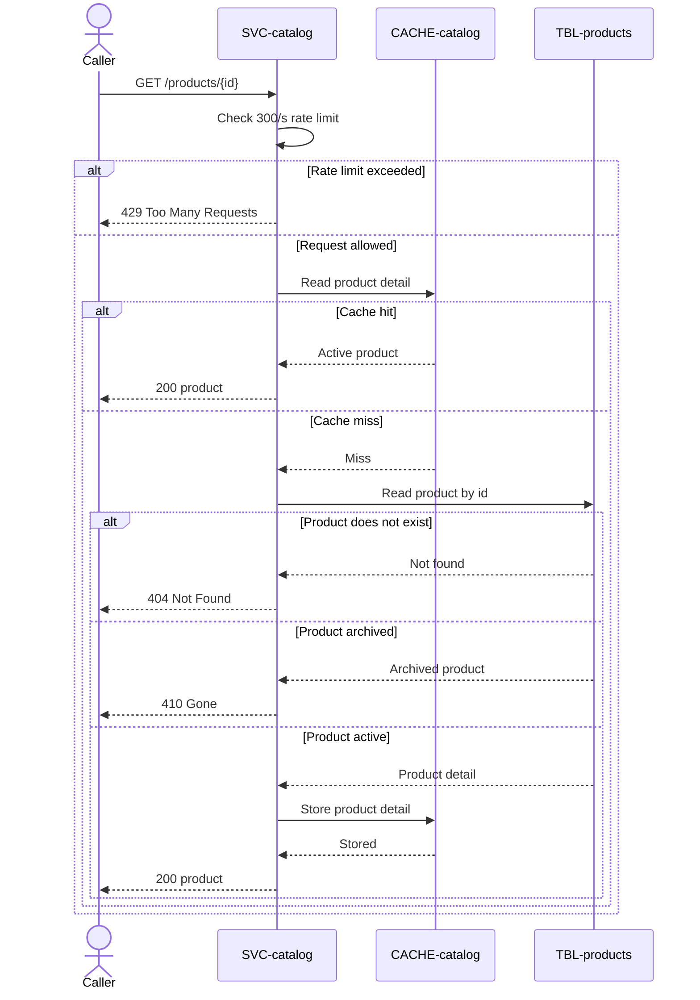

# Get product

`GET /products/{id}`, exposed by
[SVC-catalog](overview.md). The product detail page.
Read-through cached, so it is the endpoint
[CACHE-catalog](../../datastores/CACHE-catalog/overview.md) exists to serve.
Satisfies [REQ-catalog-product-detail](../../features/FEAT-catalog/overview.md#req-catalog-product-detail).

# Request

| Field | Location | Type | Required | Description |
|---|---|---|---|---|
| `id` | path | string (uuid) | yes | Product identifier. |

# Response

| Field | Status | Type | Required | Description |
|---|---|---|---|---|
| `product` | 200 | object | yes | Product detail with all image sizes. |

Responses `404`, `410`, and `429` have no response body.

## Status codes

| Code | When |
|---|---|
| 200 | product returned |
| 404 | no such product id |
| 410 | product archived |
| 429 | rate limit exceeded |

# Behavior

On a cache miss, reads [products](../../datastores/DB-shop/TBL-products.md), fills
the cache, and returns. An `archived` product returns 410 rather than 404 — the
URL was once valid, which matters for SEO and for old links.

# Sequence diagram

