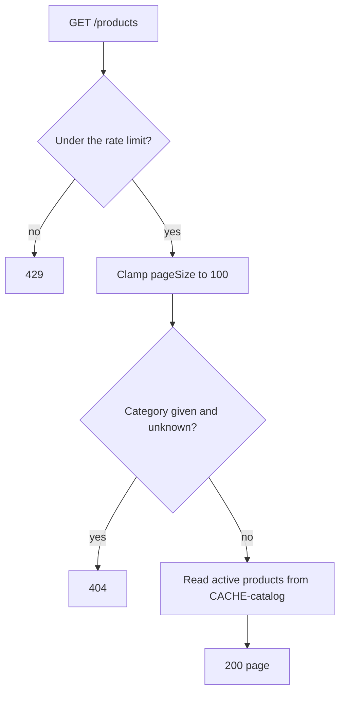
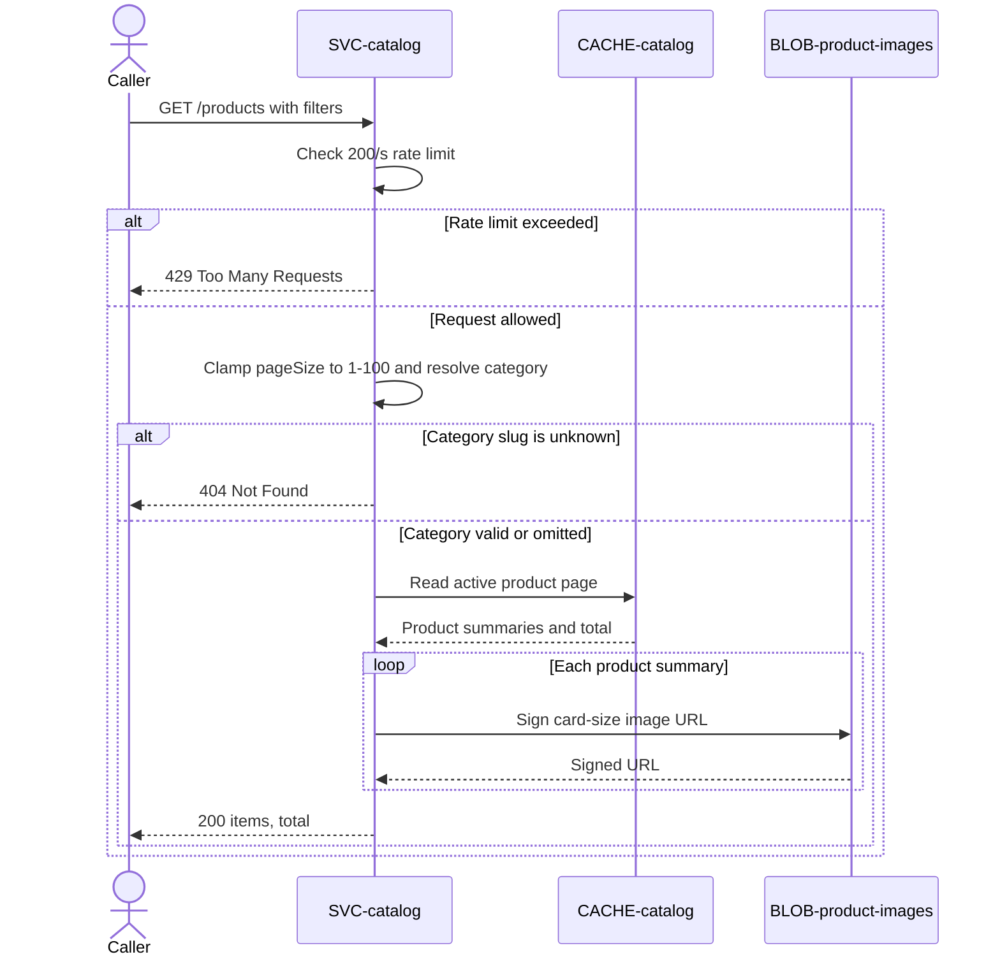

# List products

`GET /products`, exposed by
[SVC-catalog](overview.md). Public — no auth; the
storefront calls it for every category page. Satisfies
[REQ-catalog-browse-by-category](../../features/FEAT-catalog/overview.md#req-catalog-browse-by-category).

# Request

| Field | Location | Type | Required | Description |
|---|---|---|---|---|
| `category` | query | string (slug) | no | Category filter. |
| `page` | query | integer | no | Page number; defaults to 1. |
| `pageSize` | query | integer | no | Items per page; defaults to 24 and is capped at 100. |

# Response

| Field | Status | Type | Required | Description |
|---|---|---|---|---|
| `items` | 200 | array of product summaries | yes | Active products with signed card-image URLs. |
| `total` | 200 | integer | yes | Matching active-product count. |

Responses `404` and `429` have no response body.

## Status codes

| Code | When |
|---|---|
| 200 | page returned |
| 404 | unknown category slug |
| 429 | rate limit exceeded |

# Validations

| Rule | Fails with |
|---|---|
| Request is under the rate limit | `429` |
| `category`, when given, resolves to a category slug | `404` |

# Behavior

A `pageSize` over 100 is clamped to 100, not rejected. Served from [CACHE-catalog](../../datastores/CACHE-catalog/overview.md); only
`active` products appear. Each item carries a signed
[image](../../datastores/BLOB-product-images/overview.md) URL for the `card` size.

# Flowchart

# Sequence diagram

