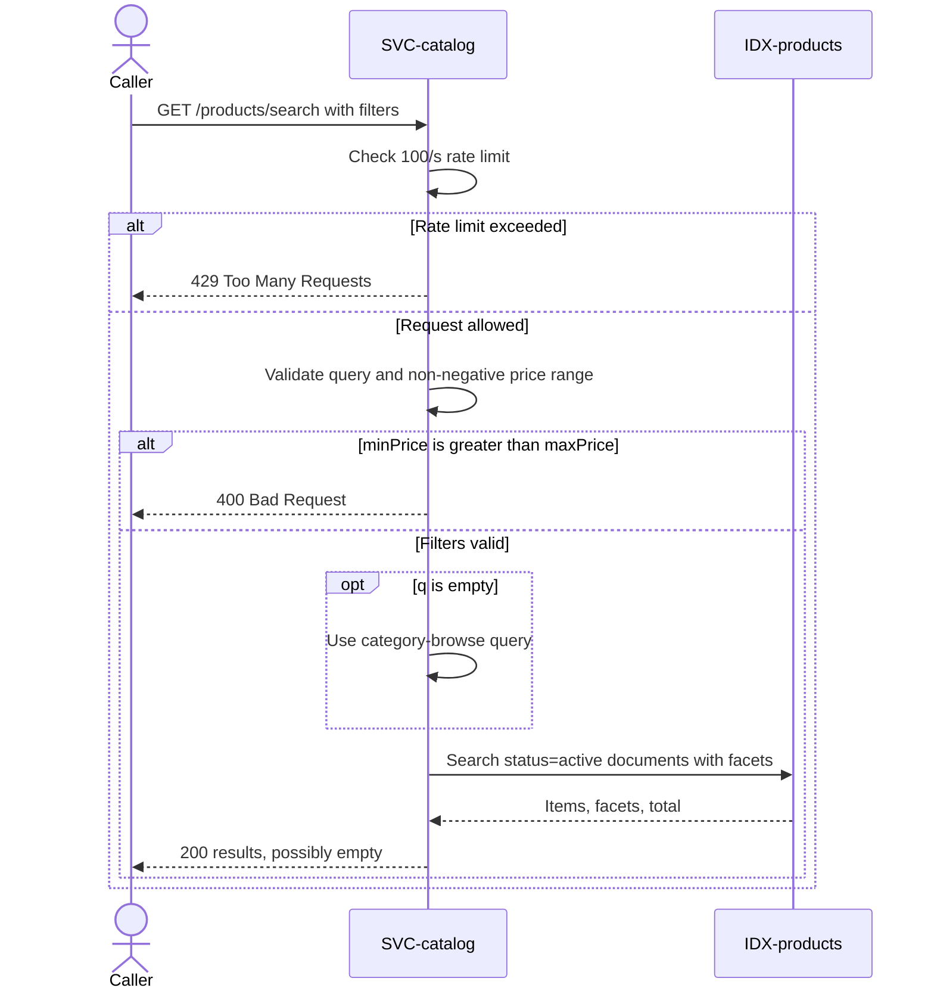

# Search products

`GET /products/search`, exposed by
[SVC-catalog](overview.md). Full-text search with
category and price facets, served by
[IDX-products](../../datastores/IDX-products/overview.md). Satisfies
[REQ-catalog-keyword-search](../../features/FEAT-catalog/overview.md#req-catalog-keyword-search).

# Request

| Field | Location | Type | Required | Description |
|---|---|---|---|---|
| `q` | query | string | no | Search terms; empty falls back to category browsing. |
| `category` | query | string | no | Category facet filter. |
| `minPrice` / `maxPrice` | query | number | no | Inclusive non-negative price range. |
| `page` / `pageSize` | query | integer | no | Result pagination. |

# Response

| Field | Status | Type | Required | Description |
|---|---|---|---|---|
| `items` | 200 | array of product summaries | yes | Matching active products. |
| `facets` | 200 | object | yes | Category and price-bucket counts. |
| `total` | 200 | integer | yes | Matching document count. |

Responses `400` and `429` have no response body.

## Status codes

| Code | When |
|---|---|
| 200 | results (possibly empty) |
| 400 | `minPrice` > `maxPrice` |
| 429 | rate limit exceeded |

# Validations

| Field | Constraint |
|---|---|
| `q` | 1–200 chars; empty falls back to a category browse |
| `minPrice`/`maxPrice` | ≥ 0; min ≤ max |

# Behavior

Only `status=active` documents are searchable — the index filters archived
products out, so search can never surface something the detail page would 410.
The search index is eventually consistent with Postgres (see
[SVC-search-indexer](../SVC-search-indexer/overview.md)); a product
edited a second ago may take a moment to re-rank.

# Sequence diagram

