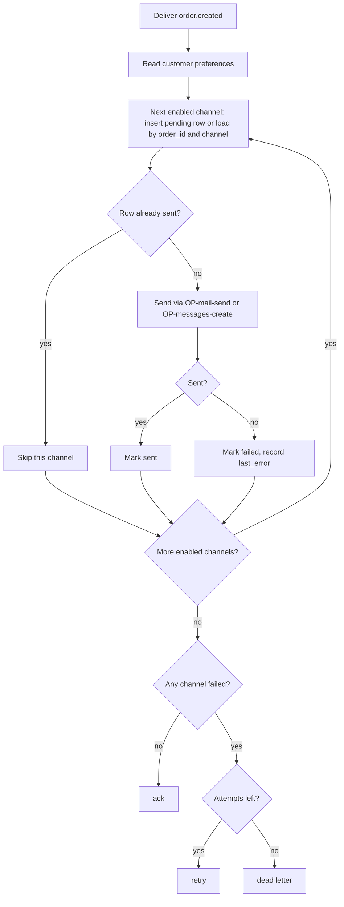
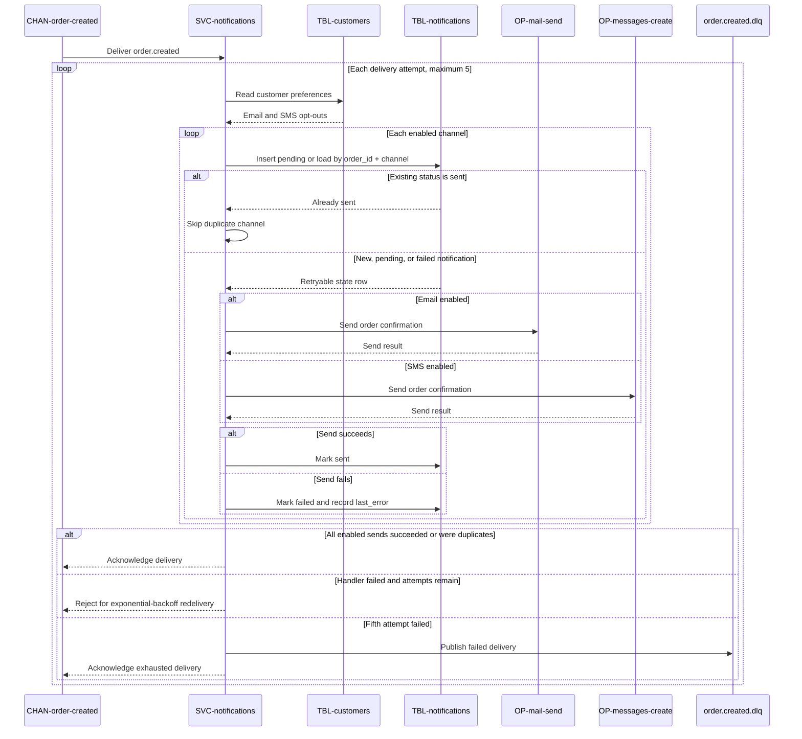

# On order created

Consumes [CHAN-order-created](../../channels/CHAN-order-created/overview.md) as
consumer group `notifications`, for
[SVC-notifications](overview.md).

Satisfies [REQ-order-notifications-confirmation-sent](../../features/FEAT-order-notifications/overview.md#req-order-notifications-confirmation-sent),
[REQ-order-notifications-failure-never-blocks](../../features/FEAT-order-notifications/overview.md#req-order-notifications-failure-never-blocks), and
[REQ-order-notifications-channel-opt-out](../../features/FEAT-order-notifications/overview.md#req-order-notifications-channel-opt-out).

# Consumes

* [order.created](../../channels/CHAN-order-created/overview.md)

# Validations

No validations.

# Handler

1. Read the customer from
   [customers](../../datastores/DB-shop/TBL-customers.md).
2. For each channel the customer has **not** opted out of (`email`, `sms`):
   1. Insert a `pending` row into
      [notifications](../../datastores/DB-shop/TBL-notifications.md) keyed
      by `(order_id, channel)`, or load the existing row. **Persist before
      send.**
   2. If the existing row is `sent`, this is a redelivery. Stop for this channel;
      do not send again. A `pending` or `failed` row remains retryable.
   3. Send via [OP-mail-send](../../externals/EXT-sendgrid/OP-mail-send.md)
      or
      [OP-messages-create](../../externals/EXT-twilio/OP-messages-create.md).
   4. On success mark `sent`; on failure mark `failed`, record `last_error`, and
      let the retry policy redeliver.

# Flowchart

# Sequence diagram

# Idempotency

| | |
|---|---|
| Key | `(order_id, channel)` |
| Enforced by | the unique index on [notifications](../../datastores/DB-shop/TBL-notifications.md) |

The broker guarantees **at-least-once**, so a redelivery is normal, not
exceptional. The unique index gives every `(order_id, channel)` one durable state
row. A `sent` row suppresses a duplicate send; a `pending` or `failed` row is
reused by a retry. The database state, not the broker or a dedupe cache, decides
whether work remains.

Ordering is not required: notifications for two different orders are independent,
which is why `concurrency: 8` is safe.

# Failure behavior

| | |
|---|---|
| Retry | exponential backoff, 1s base |
| Max attempts | 5 |
| Then | dead-letter, following the channel's [dead-letter policy](../../channels/CHAN-order-created/overview.md#dead-letter) |

A failure is **never** acked back to
[SVC-orders](../SVC-orders/overview.md) — the order stands regardless.
A customer who never gets an email still has an order.

# Pending changes

* [CR-sms-notifications](../../change-requests/CR-sms-notifications/overview.md) — modified — the handler loop over channels is not live; production sends one email.
