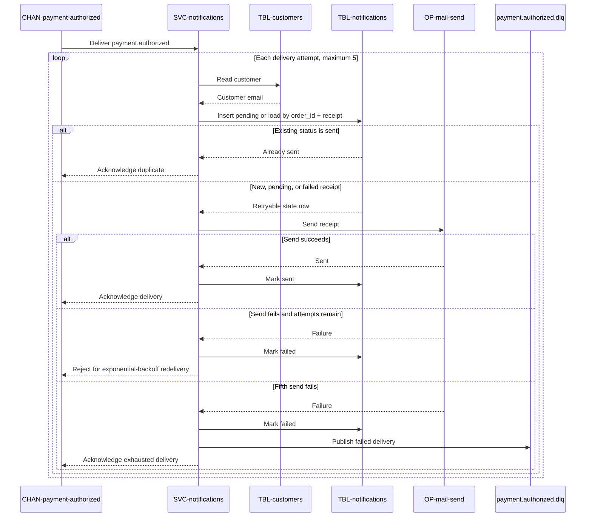

# On payment authorized

Consumes [CHAN-payment-authorized](../../channels/CHAN-payment-authorized/overview.md)
as consumer group `notifications-receipts`, for
[SVC-notifications](overview.md). Sends the
payment receipt — distinct from the order-placed confirmation that
[SUB-order-created](SUB-order-created.md) sends.

# Consumes

* [payment.authorized](../../channels/CHAN-payment-authorized/overview.md)

# Handler

1. Read the customer from
   [customers](../../datastores/DB-shop/TBL-customers.md).
2. Insert a `pending` row into
   [notifications](../../datastores/DB-shop/TBL-notifications.md) keyed by
   `(order_id, channel)` with `channel = receipt`, or load the existing row.
   **Persist before send.**
3. If the existing row is `sent`, this is a redelivery — stop. A `pending` or
   `failed` row remains retryable.
4. Send the receipt email via
   [OP-mail-send](../../externals/EXT-sendgrid/OP-mail-send.md); mark `sent` or
   `failed`.

# Idempotency

| | |
|---|---|
| Key | `(order_id, 'receipt')` |
| Enforced by | the unique index on [notifications](../../datastores/DB-shop/TBL-notifications.md) |

Same durable-state idempotency as the order-created handler: the `receipt`
channel value keeps a receipt from colliding with the order confirmation for the
same order. A `sent` row deduplicates a redelivery; `pending` and `failed` rows
allow the configured retries to continue.

# Failure behavior

| | |
|---|---|
| Retry | exponential backoff, 1s base |
| Max attempts | 5 |
| Then | dead-letter, following the channel's [dead-letter policy](../../channels/CHAN-payment-authorized/overview.md#dead-letter) |

A failed receipt never affects the payment or the order — it is a downstream
courtesy, decoupled by the event just like the order confirmation.

# Sequence diagram

