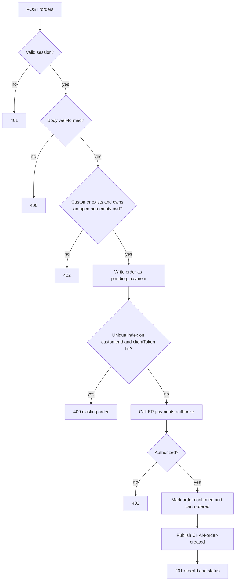
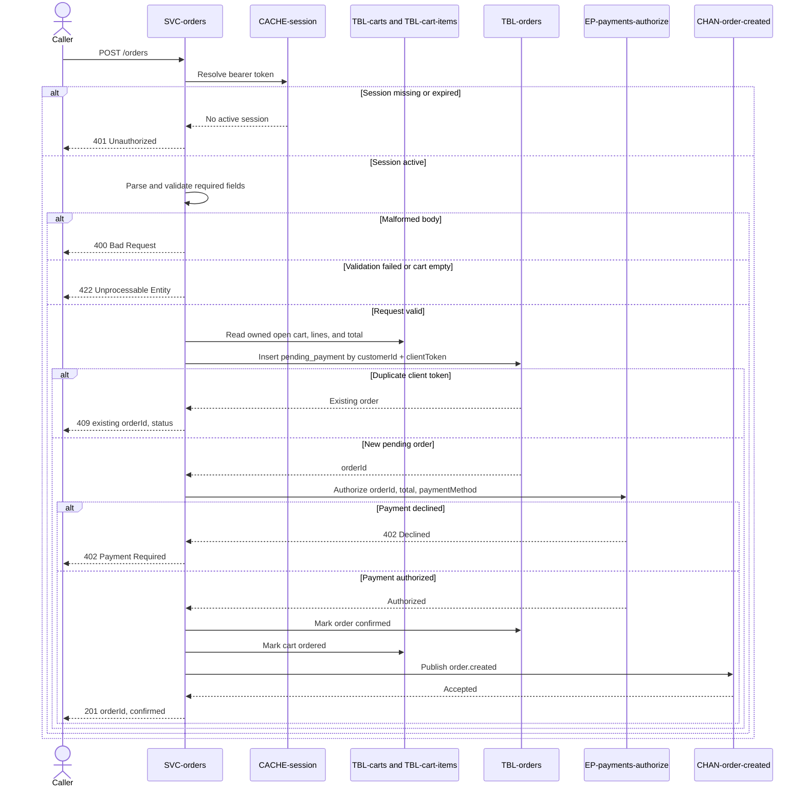

# Create Order

`POST /orders`, exposed by [SVC-orders](overview.md).
JWT-authenticated; the caller must be the customer placing the order.

Satisfies [REQ-checkout-complete-purchase](../../features/FEAT-checkout/overview.md#req-checkout-complete-purchase) and
[REQ-checkout-pay-before-confirm](../../features/FEAT-checkout/overview.md#req-checkout-pay-before-confirm).

# Request

| Field | Location | Type | Required | Description |
|---|---|---|---|---|
| `Authorization` | header | bearer token | yes | Customer session token. |
| `cartId` | body | string (uuid) | yes | Open cart to order. |
| `customerId` | body | string (uuid) | yes | Customer placing the order. |
| `paymentMethod` | body | string | yes | Stripe token from the browser. |
| `clientToken` | body | string | yes | Client idempotency token. |

# Response

| Field | Status | Type | Required | Description |
|---|---|---|---|---|
| `orderId` | 201, 409 | string (uuid) | yes | Created or previously created order. |
| `status` | 201, 409 | string | yes | Order status; `confirmed` on creation. |

Responses `400`, `401`, `402`, and `422` have no response body.

## Status codes

| Code | When |
|---|---|
| 201 | order created and confirmed |
| 400 | malformed body |
| 401 | missing or expired session |
| 402 | payment declined |
| 409 | already created (duplicate client token) |
| 422 | empty cart or validation failed |

# Validations

| Rule | Fails with |
|---|---|
| `Authorization` carries a valid session | `401` |
| The body is well-formed and `cartId`, `customerId`, `paymentMethod` and `clientToken` are present | `400` |
| `customerId` exists in [customers](../../datastores/DB-shop/TBL-customers.md) | `422` |
| `cartId` is an `open`, non-empty cart owned by `customerId` | `422` |

# Behavior

1. Read the [cart](../../datastores/DB-shop/TBL-carts.md) and its
   [lines](../../datastores/DB-shop/TBL-cart-items.md); sum the snapshotted prices
   to the order total.
2. Write the [order](../../datastores/DB-shop/TBL-orders.md) as `pending_payment`
   with the `clientToken`.
3. Call
   [EP-payments-authorize](../SVC-payments/EP-payments-authorize.md)
   with `orderId` and the total. On decline, leave the order `pending_payment` and
   return `402`.
4. On authorization, mark the order `confirmed`, mark the cart `ordered`, and
   publish [CHAN-order-created](../../channels/CHAN-order-created/overview.md) — in
   that order, so no event references an unconfirmed order.

Idempotency is by `(customerId, clientToken)`: a retried submit hits the unique
index on [orders](../../datastores/DB-shop/TBL-orders.md) and returns the existing
order (`409`) instead of creating or paying twice. Clients must send a token, not
blind-retry.

# Flowchart

# Sequence diagram

