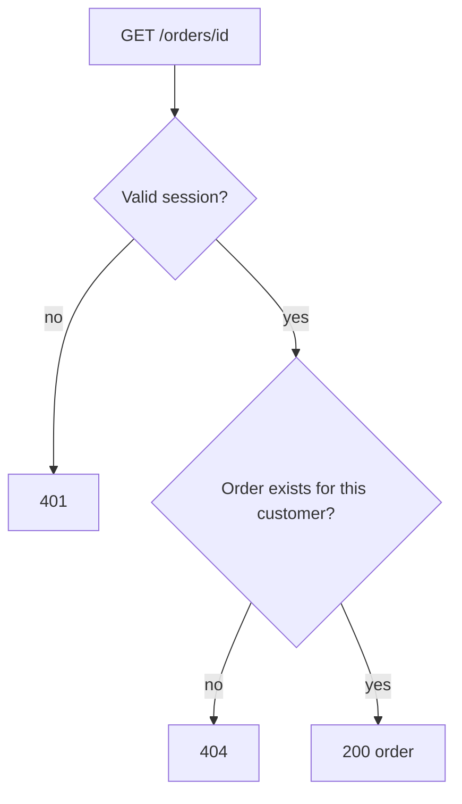
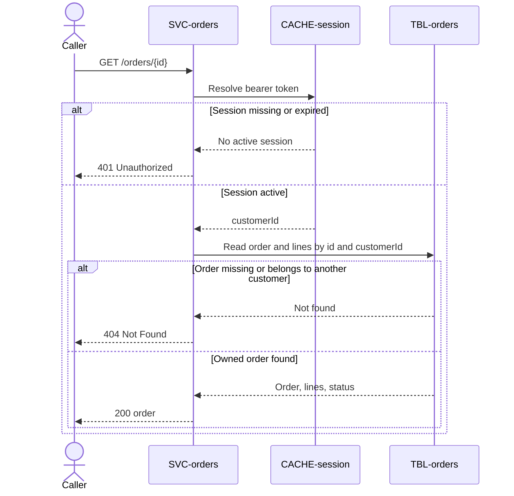

# Get Order

`GET /orders/{id}`, exposed by
[SVC-orders](overview.md). Returns one order and its
lines for the order-confirmation and order-history pages.

# Request

| Field | Location | Type | Required | Description |
|---|---|---|---|---|
| `Authorization` | header | bearer token | yes | Customer session token. |
| `id` | path | string (uuid) | yes | Order identifier. |

# Response

| Field | Status | Type | Required | Description |
|---|---|---|---|---|
| `order` | 200 | object | yes | Owned order with lines and status. |

Responses `401` and `404` have no response body.

## Status codes

| Code | When |
|---|---|
| 200 | order returned |
| 401 | missing or expired session |
| 404 | no such order for this customer |

# Validations

| Rule | Fails with |
|---|---|
| `Authorization` carries a valid session | `401` |
| The order belongs to the session's customer | `404` |

# Behavior

Reads [orders](../../datastores/DB-shop/TBL-orders.md). An order that belongs to a
different customer returns `404`, never another customer's order — ownership is
checked against the session, not just the id.

# Flowchart

# Sequence diagram

