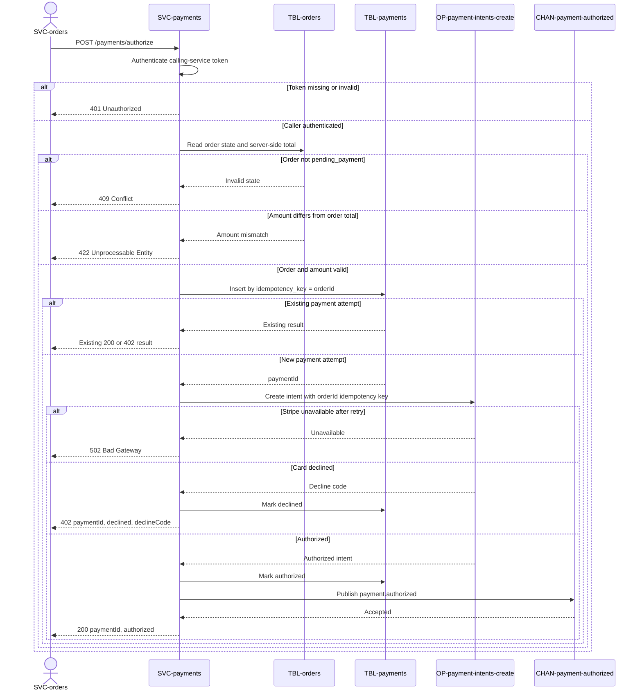

# Authorize payment

`POST /payments/authorize`, exposed by
[SVC-payments](overview.md). Called synchronously by
[SVC-orders](../SVC-orders/overview.md) during checkout, before the
order is confirmed. Satisfies
[REQ-payments-authorize-once](../../features/FEAT-payments/overview.md#req-payments-authorize-once).

# Request

| Field | Location | Type | Required | Description |
|---|---|---|---|---|
| `Authorization` | header | bearer token | yes | Calling-service token. |
| `orderId` | body | string (uuid) | yes | Order and idempotency key. |
| `amountUsd` | body | number | yes | Amount that must match the server-side order total. |
| `paymentMethod` | body | string | yes | Stripe token from the browser. |

# Response

| Field | Status | Type | Required | Description |
|---|---|---|---|---|
| `paymentId` | 200, 402 | string (uuid) | yes | Payment attempt. |
| `status` | 200, 402 | string (`authorized` \| `declined`) | yes | Authorization result. |
| `declineCode` | 402 | string | conditional | Required when `status` is `declined`. |

Responses `401`, `409`, `422`, and `502` have no response body.

## Status codes

| Code | When |
|---|---|
| 200 | authorized |
| 401 | missing or invalid calling-service token |
| 402 | card declined (terminal; body carries `declineCode`) |
| 409 | order not in `pending_payment` |
| 422 | amount does not match the order total |
| 502 | Stripe unavailable after retry |

# Validations

| Field | Constraint |
|---|---|
| `orderId` | must reference an order in `pending_payment` |
| `amountUsd` | must equal the order total server-side — never trust the client amount |

# Behavior

Idempotent on `orderId`: the row in
[payments](../../datastores/DB-shop/TBL-payments.md) is inserted with
`idempotency_key = orderId` before the Stripe call, and the same key is forwarded
to [OP-payment-intents-create](../../externals/EXT-stripe/OP-payment-intents-create.md),
so a retry never double-authorizes. On success, publishes
[CHAN-payment-authorized](../../channels/CHAN-payment-authorized/overview.md).

# Sequence diagram

