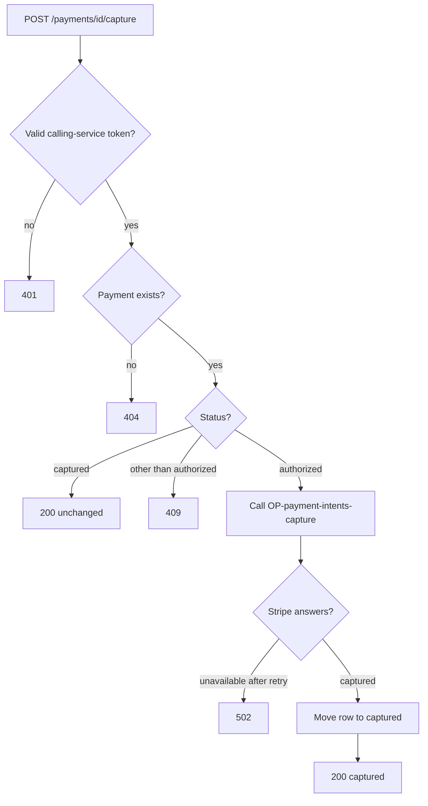
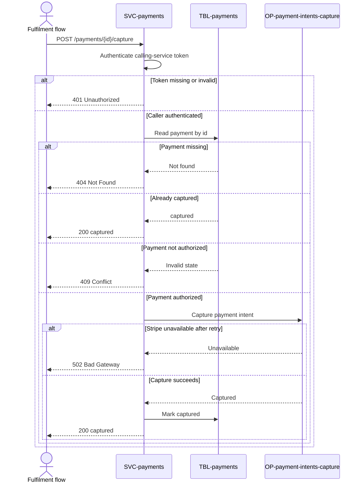

# Capture payment

`POST /payments/{id}/capture`, exposed by
[SVC-payments](overview.md). Captures a payment that
was authorized at checkout, called by the fulfilment flow when an order ships.
Separating capture from authorize means the customer is only charged for goods
that actually go out. Satisfies
[REQ-payments-capture-at-fulfilment](../../features/FEAT-payments/overview.md#req-payments-capture-at-fulfilment).

# Request

| Field | Location | Type | Required | Description |
|---|---|---|---|---|
| `Authorization` | header | bearer token | yes | Calling-service token. |
| `id` | path | string (uuid) | yes | Payment to capture. |

# Response

| Field | Status | Type | Required | Description |
|---|---|---|---|---|
| `status` | 200 | string (`captured`) | yes | Final payment status. |

Responses `401`, `404`, `409`, and `502` have no response body.

## Status codes

| Code | When |
|---|---|
| 200 | captured (or already captured) |
| 401 | missing or invalid calling-service token |
| 404 | no such payment |
| 409 | payment not in `authorized` state |
| 502 | Stripe unavailable after retry |

# Validations

| Rule | Fails with |
|---|---|
| `Authorization` carries a valid calling-service token | `401` |
| The payment exists | `404` |
| The payment is `authorized`, or already `captured` | `409` |

# Behavior

Reads the [payments](../../datastores/DB-shop/TBL-payments.md) row, calls
[OP-payment-intents-capture](../../externals/EXT-stripe/OP-payment-intents-capture.md),
and moves the row to `captured`. Capturing an already-captured payment returns
`200` unchanged — capture is idempotent per Stripe intent.

# Flowchart

# Sequence diagram

