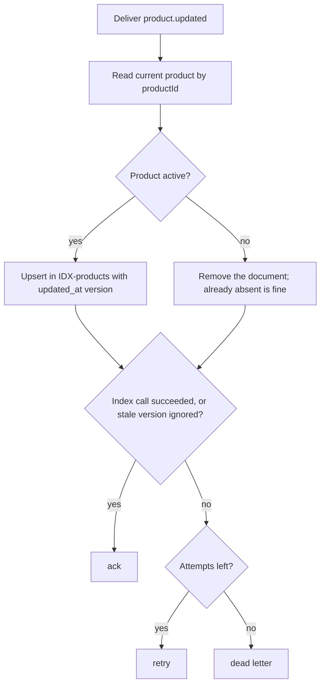
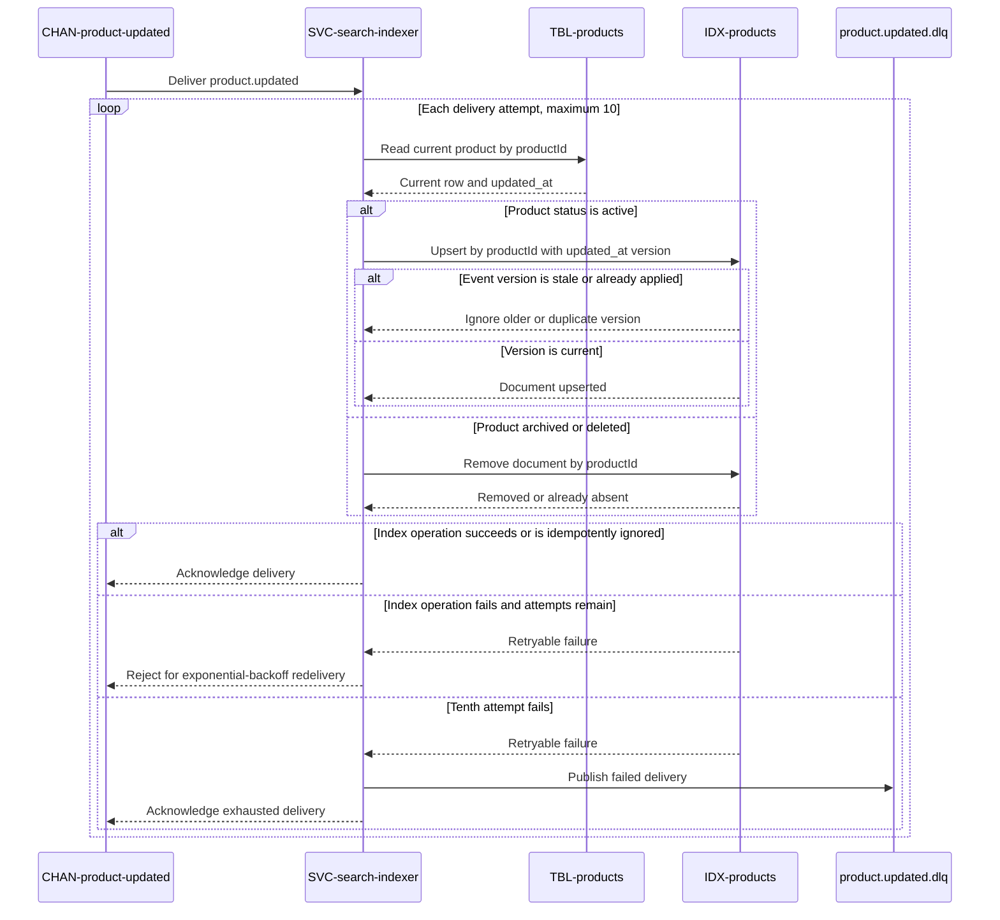

# On product updated

Consumes [CHAN-product-updated](../../channels/CHAN-product-updated/overview.md)
as consumer group `search-indexer`, for
[SVC-search-indexer](overview.md). Satisfies
[REQ-catalog-keyword-search](../../features/FEAT-catalog/overview.md#req-catalog-keyword-search).

# Consumes

* [product.updated](../../channels/CHAN-product-updated/overview.md)

# Validations

No validations.

# Handler

1. Read the current product from
   [products](../../datastores/DB-shop/TBL-products.md) by `productId`.
2. If `status = active`, upsert the document into
   [IDX-products](../../datastores/IDX-products/overview.md).
3. Otherwise (archived / deleted), remove the document from the index.

The handler always reads the **current** row rather than trusting the event body,
so a redelivered or out-of-order event converges to the true state.

# Flowchart

# Sequence diagram

# Idempotency

| | |
|---|---|
| Key | `productId` + the row's `updated_at` |
| Enforced by | OpenSearch `version` / external versioning on upsert |

Upserting by document id is naturally idempotent; using the row's `updated_at` as
the external version means a **stale** event (an older update arriving after a
newer one) is dropped by the index rather than clobbering fresh data. This is why
the topic is ordered per product — belt and braces against re-ranking on a stale
title.

# Failure behavior

| | |
|---|---|
| Retry | exponential backoff, 2s base |
| Max attempts | 10 |
| Then | dead-letter, following the channel's [dead-letter policy](../../channels/CHAN-product-updated/overview.md#dead-letter) |

A dead-lettered product is simply stale in search until the next edit or a bulk
reindex — search being briefly wrong is tolerable, which is why this is `tier-2`,
not `tier-1`.

